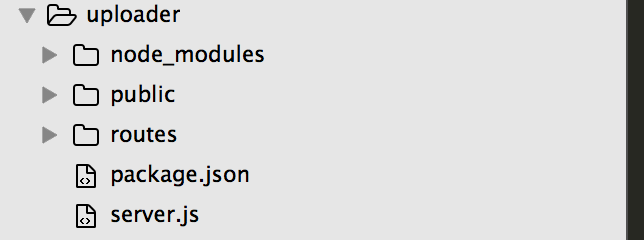
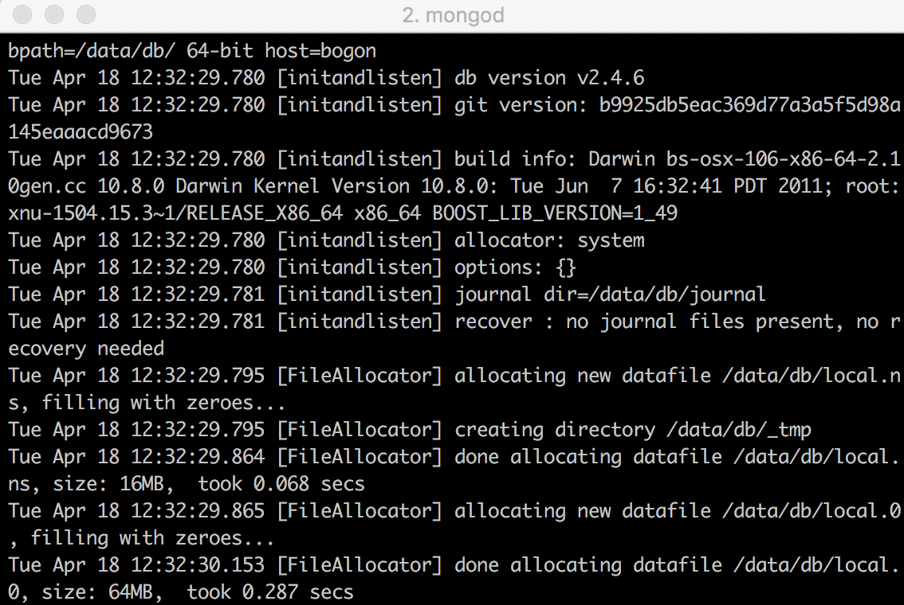
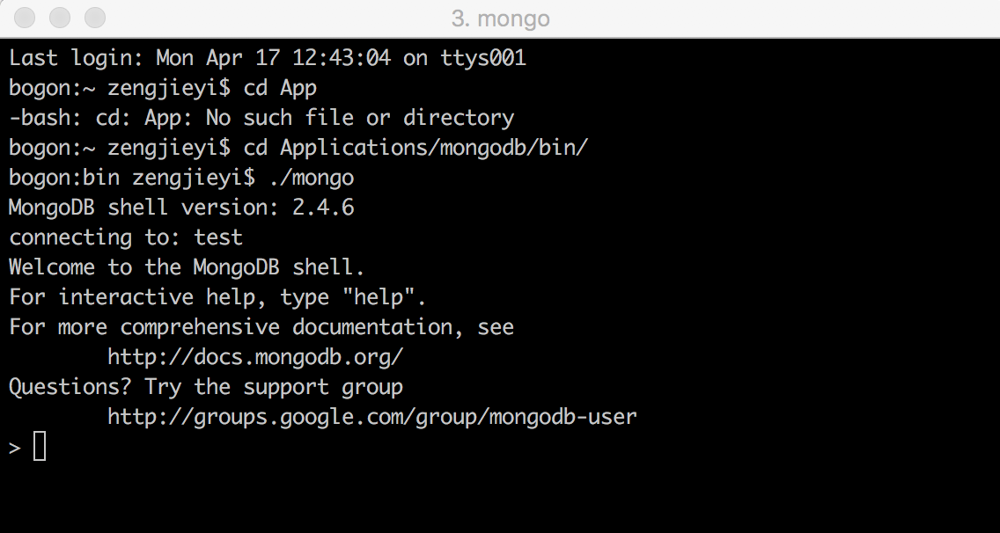
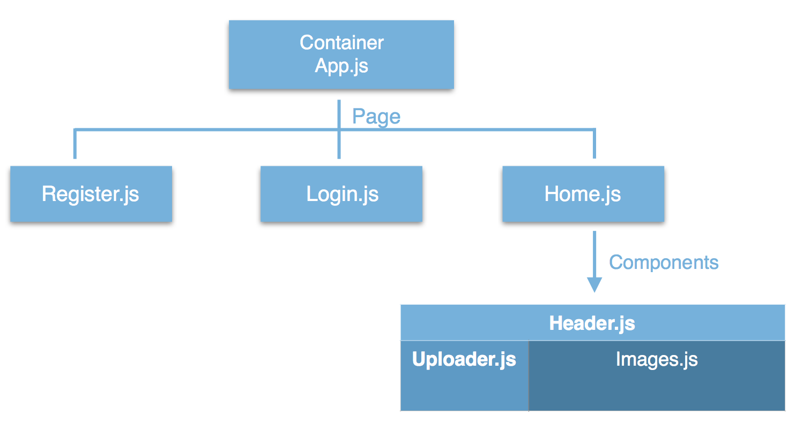
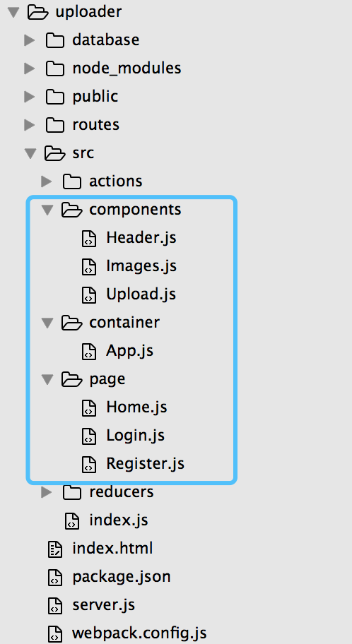

title: 基于react+nodejs+mongodb+webpack+redux实现图片上传应用
date: 2017-04-18 12:40:49
tags:
---

## 前言
为了能够更好地掌握react、nodejs、webpack等知识，开始这个基于react+nodejs+mongodb+webpack+redux实现前后端图片上传的应用。这个项目从开始到实现，包括了登陆、注册、图片展示等页面，功能较简单，有登录、注册、上传图片、复制图片链接、删除图片等功能。在这过程中，遇到了很多个bug，但每一个bug都可以让我对知识的学习了解更加巩固。

## 技术栈
react+webpack+mongodb+webpack+redux+ES6+fetch

## 项目运行
```
//下载项目
$ git clone https://github.com/ggstudy-ddup/react-pic-uploader.git
$ cd react-pic-uploader/demo
//安装依赖
$ npm install
//启动项目
$ webpack && node server.js

```
## 搭建开发环境
---
#### npm初始化
首先创建名为uploader的目录，切换到此目录，然后初始化文件。
```
mkdir uploader && cd uploader
npm init

```

#### 安装必要的开发工具包
- webpack : 模块打包工具
- redux : javascript状态容器
- formidable : 用于上传文件的node.js模块包
- express-session : 用于将数据存储在服务器上的node.js中间件
- body-parser : node.js解析body的中间键

```
npm install webpack redux formidable express-session body-parser --save-dev
```

#### 安装生产环境依赖包
- react : 主要框架
- react-dom : React的DOM操作类
- react-router : React的路由库
- express : 主要的node.js Web应用框架
- cookie-parser : express中使用cookie的API
- csurf : node.js csrf防御中间件
- mongoose : mongoose数据库
- path : node.js用于处理文件路径的模块
- fs : node.js用于提供本地文件读写能力的模块

```
npm install react react-dom react-router express cookie-parser csurf mongoose --save
```

#### 搭建node.js服务器
这个项目中使用[express](http://expressjs.com/zh-cn/)框架搭建。搭建express基本目录结构：

** public是项目的静态文件，**放置js css img等文件
** routes是项目的路由信息文件，**控制地址路由
在uploader的目录中，创建名为server.js的文件，添加如下代码：
```
    var express = require('express');
    var cookieParser = require("cookie-parser");
    var csrf = require('csurf');
    var mongoose = require("mongoose");
    var session = require('express-session');
    var bodyParser = require('body-parser');
    var routes = require('./routes/index');
    var checkedRoutes = require('./routes/checkedIndex');

    //mongoose数据库
    global.dbHandle = require('./database/dbHandle');
    global.db = mongoose.connect("mongodb://localhost:27017/uploadimgdb");

    var app = express();

    app.use(cookieParser());
    app.use(express.static(__dirname));
    app.use(bodyParser.json());
    app.use(bodyParser.urlencoded({extended : true}));


    app.use(session({
        secret : 'hello',
        resave : false,
        saveUninitialized : true,
        cookie : {
            path : "/",
            maxAge : 600000
        }
    }))

    app.use("/",routes);
    app.use('/upload', routes);
    app.use('/register', routes);
    app.use('/login', routes);
    app.use('/logout', routes);
    app.use('/getImages', routes);

    // csrf防御
    app.use(csrf());
    app.use("/",checkedRoutes);
    app.use('/isLogin', checkedRoutes);
    app.use('/deleteImages', checkedRoutes);


    //error handle
    app.use((err,req,res,next) => {
        res.status(err.status || 500);
    })
    
    //服务器
    var PORT = process.env.PORT || 9990;
    app.listen(PORT,function(){
        console.log('Production Express server running at localhost:' + PORT)
    })
```
在server.js源码中的判断是否登录与删除图片需要csrf防御，所以将这两个路由放入到另外的路由页面中。
另外项目中包含注册登录上传图片，所以需要数据库来存储这些数据，这个项目使用mongodb进行数据的存储。详细mongodb可自行查阅～

#### 安装mongoDB，配置项目数据库
1.下载mongodb
```
curl http://downloads.mongodb.org/osx/mongodb-osx-x86_64-2.4.6.tgz > mongodb.tgz
```
2.解压mongodb
```
tar -zxvf mongodb-osx-x86_64-2.4.6
```
3.将解压的安装文件移动到想要存放的位置,我的是从Download移动到Applications的mongodb中
```
mv -n ~/Downloads/mongodb-osx-x86_64-2.4.6 ~/Applications/mongodb/
```
4.在mongodb根目录下创建data/db目录，用于存放mongodb数据，并给改目录设置权限
```
sudo mkdir -p data/db
sudo chown -R zengjieyi /data
```
5.启动mongodb
```
cd bin
./mongod
```

6.进入mongodb shell,可直接编辑数据库
 打开另外一个终端
 ```
 cd Applications/mongodb/bin
 ./mongo
 ```

7.在uploader的项目中，创建database文件路径，建立models.js存放数据model，建立dbHandle.js，存放对数据的操作。
** models.js **
```
//主要存储用户姓名、密码、上传的图片
module.exports = {
    users :{
        name : { type : String , required :true},
        password : { type : String , required : true},
        imageUpload : [{ imgUrl : String , name : String }]
    }
}
```
** dbHandle.js **
```
//用于获取数据的操作
var mongoose = require('mongoose');
var Schema = mongoose.Schema;
var models = require('./models.js');

for(var m in models){
    mongoose.model(m,new Schema(models[m]));
}

module.exports = {
    getModel : function(type){
        return _getModel(type);
    }
};

var _getModel = function(type){
    return mongoose.model(type);
}
```
8.项目绑定数据库已在server.js添加
```
//mongoose数据库
    global.dbHandle = require('./database/dbHandle');
    global.db = mongoose.connect("mongodb://localhost:27017/uploadimgdb");
```

#### 建立项目路由
这个项目根据需要csrf防御与否分为两个路由文件，index.js主要是登录、注册、退出登录、上传图片、获取图片、主页，checkIndex.js主要是判断是否登录、删除图片、主页。
** index.js **
```
var express = require('express');
var session = require('express-session');
var router = express.Router();
var formidable = require("formidable");
var path = require('path');
var fs = require("fs");
var csrf = require('csurf');

// 注册
router.post("/register",(req,res) => {
    var User = global.dbHandle.getModel("users");
    var uname = req.body.uname,
        upwd = req.body.upwd,
        result = {};

    User.findOne({name : uname },(err , doc) => {
        if(err){
            res.rend(500);
        }else if(doc){
            res.send(501);  //用户名已经存在
        }else{
            User.create({
                name : uname,
                password : upwd
            },(err , doc ) => {
                if(err){    
                    res.send(500);
                }else{
                    var user = JSON.parse(JSON.stringify(doc));
                    req.session.user = user.name;
                    res.send(200);  //注册成功
                }
            })
        }
    })
});

//登陆
router.post("/login",(req,res) => {
    var User = global.dbHandle.getModel('users'),
        uname = req.body.uname,
        sess = req.session;

    User.findOne({
        name : uname
    }, (err,doc) => {
        if(err){    
            res.sendStatus(500);      //登陆失败
        }else if(!doc){
            res.sendStatus(404);      //用户名不存在
        }else{
            if(req.body.upwd != doc.password){
                res.sendStatus(403);      //密码错误
            }else{
                var user = JSON.parse(JSON.stringify(doc));
                sess.user = user.name;
                res.sendStatus(200);        //登陆成功
            }
        }
    })
});

//退出登陆
router.post("/logout",(req,res) => {
    req.session.user = null;
    req.session.imgUrl = null;
    res.send("200");
});

//上传图片
router.post("/upload",(req,res) => {
    var form = new formidable.IncomingForm(),
        targetDir = path.join(__dirname,"../public/uploadImages"),
        User = global.dbHandle.getModel('users'),
        filesArr = [],
        extName = '',
        times = new Date().getTime(),
        imgArr = req.session.imgArr == undefined ? [] : req.session.imgArr;

    form.encoding = 'utf-8';        //设置编码
    form.uploadDir = targetDir;     //设置上传目录
    form.keepExtensions = true;       //保留后缀
    form.maxFieldsSize = 2*1024*1024;       //设置图片大小
    
    //检验存储上传的文件是否存在
    fs.access(targetDir,(err) => {
        if(err){
            fs.mkdirSync(targetDir);
        }
        _fileParse();
    });

    function _fileParse(){
        form.on("file",(filed,file) => {
            filesArr.push(file);
        })

        form.parse(req, (err, fields, files) => {
            if(err){
                res.locals.error = err;
                return;
            }
            for(var obj of filesArr){
                var filePath = obj.path,
                    fileOleName = obj.name.substring(0,obj.name.lastIndexOf('.')),
                    fileExt = filePath.substring(filePath.lastIndexOf('.')),
                    curTime = new Date().getTime();

                times = times == curTime ? (curTime+1) : curTime;

                var fileName = times + fileExt,
                    targetFile = path.join(targetDir,fileName);

                fs.renameSync(filePath, targetFile);
                imgArr.push({imgUrl:`/public/uploadImages/${fileName}`,name:fileOleName });
            }

            User.update({
                name : req.session.user
            },{
                imageUpload : imgArr
            },(err) => {
                if(err){
                    res.send(500);
                }
            })
            req.session.imgArr = imgArr;
            res.sendStatus(200);
            // res.redirect("/");
        })
    }
});

//获取图片
router.get("/getImages",(req,res) => {
    var User = global.dbHandle.getModel("users");
    var imgArr = req.session.imgArr == undefined ? [] : req.session.imgArr;

    User.findOne({
        name : req.session.user
    },(err,doc) => {
        if(err){
            res.send(404);
        }else if(doc){
            doc = JSON.parse(JSON.stringify(doc));
            if(doc.imageUpload){
                imgArr = doc.imageUpload;
                req.session.imgArr = imgArr;
                console.log(imgArr);
                res.json(imgArr);
            }
        }else{
            res.json(imgArr);
        }
    })
});

router.get("/",(req,res) => {
    var sess = req.session;
    res.send(200);
})

module.exports = router;
```
** checkedIndex.js **
```
var express = require('express');
var session = require('express-session');
var router = express.Router();
var fs = require("fs");
var csrf = require('csurf');


//判断是否登陆
router.get("/isLogin",(req,res) => {
    var sess = req.session,
        token = sess.token;

    if(sess.user){
        token = token == undefined ? req.csrfToken() : token;
        sess.token = token;

        res.send(JSON.stringify({code : 200 , user : sess.user , token : token}));
    }else{
        res.send(JSON.stringify({code : 403}))
    }
});

//删除图片
router.post("/deleteImages",(req,res) => {
    var User = global.dbHandle.getModel("users"),
        num = req.body.num,
        imgArr = req.session.imgArr,
        imgUrl = imgArr[num].imgUrl,
        filePath = imgUrl.substring(1);

    //本地文件删除
    fs.unlink(filePath,(err) => {
        if(err){
            console.log(err);
        }
    })

    imgArr.splice(num,1);

    User.update({
        name : req.session.user
    },{
        imageUpload : imgArr
    },(err) => {
        if(err){
            res.send(500);
        }else{
            req.session.imgArr = imgArr;
            res.send(200);
        }
    })
});

router.get("/",(req,res) => {
    var sess = req.session;
    res.send(200);
})
module.exports = router;
```
到这里node.js搭建服务器与相关后端接口已经差不多了，接下来开始搭建页面吧～～

## 配置webpack
由于项目中使用到react和es6，需要webpack编译，在uploader目录下添加webpack.config.js文件
```
const path = require('path');
module.exports = {    
    entry: './src/index.js',
    output: {
        filename: './build/index.js',
        publicPath : '/'
    },
    module: {
        loaders: [
            {
                test: /\.js$/,
                exclude: /node_modules/,
                loader: 'babel-loader?presets[]=es2015&presets[]=react'
            }
        ]
    }
}
```
src/index.js为项目的编写react内容的主文件，此时需要在uploader目录下创建src文件夹并创建index.js。
项目中使用到webpack-dev-server的inline模式，需要修改package.json添加启动代码，将以下代码插入package.json中：
```
"scripts": {
    "start": "if-env NODE_ENV=production && npm run start:prod || npm run start:dev",
    "start:dev": "webpack-dev-server --inline --content-base . --histroy-api-fallback",
    "start:prod": "webpack && node server.js"
  },
"keywords": [
    "react"
]
```
启动项目文件可以通过`npm run start:prod`命令。

## 搭建页面
1.建立主页面
在uploader的目录下，创建index.html
** index.html **
```
<!DOCTYPE html>
<html lang="zh-CN">
<head>
    <meta charset="UTF-8">
    <title>基于React实现的前后端分离图片上传系统</title>
    <link rel="stylesheet" type="text/css" href="./public/css/index.css" />
</head>
<body>
    <div id="app" class="wrapper"></div>

<script src="./build/index.js"></script>
</body>
</html>
```
index.css为样式文件，此时需要在public创建css文件目录并在css中创建index.css样式文件。
index.js为webpack编译src/index.js后的文件。

2.引入redux，控制项目的数据状态
在redux中，Store用来存储数据，类似一个大的容器。State对象包含所有的数据，可以在某个点获取当时的数据。Action可以发出通知，让State发生变化。
在src文件夹内创建action文件目录和reducers文件目录分别存放对应的index.js。
** action/index.js **
```
export const REQUEST_ISLOGIN = "REQUEST_ISLOGIN"
export const RECEIVE_LOGINED = "RECEIVE_LOGINED"
export const RECEIVE_NOT_LOGIN = "RECEIVE_NOT_LOGIN"
export const REQUEST_IMAGES = "REQUEST_IMAGES"
export const RECEIVE_IMAGES = "RECEIVE_IMAGES"
export const UPLOAD_IMAGES = "UPLOAD_IMAGES"
export const EXIT_LOGIN = "EXIT_LOGIN"

//退出登录操作
export const exitLogin = () => ({
    type : EXIT_LOGIN
})
//判断是否登录前操作
export const requestIslogin = () => ({
    type : REQUEST_ISLOGIN
})
//判断是否登录后，返回已登陆的操作，返回用户名跟唯一的token
export const receiveLogined = json => ({
    type : RECEIVE_LOGINED,
    user : json.user,
    token : json.token
})
//判断是否登录后，返回为登录的操作
export const receiveNotLogined = () => ({
    type : RECEIVE_NOT_LOGIN
})
//请求图片前操作
export const requestImages = () => ({
    type : REQUEST_IMAGES
})
//请求图片后的操作，返回获取的图片
export const receiveImages = json => ({
    type : RECEIVE_IMAGES,
    images : json
})

//判断是否登录
export const fetchIslogin = () => dispatch => {
    dispatch(requestIslogin())
    return fetch("/isLogin",{
                method : "get",
                credentials: 'include',
                header : {
                    "Content-Type" : "application/json"
                }
        })
        .then(res => res.json())
        .then(json => {
            if(json.code == 200){
                dispatch(receiveLogined(json))
                dispatch(requestImages())
                return fetch("/getImages",{
                    method : "get",
                    credentials: 'include',
                    header : {
                        "Content-Type" : "application/json"
                    }
                })
                .then(res => res.json())
                .then(json => dispatch(receiveImages(json)))
            }else{
                dispatch(receiveNotLogined())
            }
        })
}
//请求图片
export const fetchImages = () => dispatch => {
    dispatch(requestImages())
    return fetch("/getImages",{
        method : "get",
        credentials: 'include',
        header : {
            "Content-Type" : "application/json"
        }
    })
    .then(res => res.json())
    .then(json => dispatch(receiveImages(json)))
}
//根据是否登录来能否请求图片
const shouldFetchImages = state => {
    const isLogin = state.user;
    if(isLogin.length > 0){
        return true
    }
    return false;
}
//根据是否登录来能否请求图片
export const fetchImagesIfNeeded = () => (dispatch,getState) => {
    console.log(getState());
    if(shouldFetchImages(getState())){
        return dispatch(fetchImages())
    }
}
//上传图片
export const uploadImages = images => ({
    type : UPLOAD_IMAGES,
    images
})
```
在这个项目中，需要从Store读取四个数据，分别是用户名user、csrf防御的token、用户的图片images，所以需要在reducers中合并输出这三个数据。
** reducers/index.js **
```
import { combineReducers } from "redux"
import { REQUEST_ISLOGIN , RECEIVE_LOGINED , RECEIVE_NOT_LOGIN , REQUEST_IMAGES , RECEIVE_IMAGES , UPLOAD_IMAGES , EXIT_LOGIN} from "../actions"

const user = (state = "",action) => {
    switch(action.type){
        case RECEIVE_LOGINED :
            return action.user
        case REQUEST_ISLOGIN :
        case RECEIVE_NOT_LOGIN :
        case EXIT_LOGIN : 
            return "";
        default :
            return state
    }
}

const token = (state="",action) => {
    switch(action.type){
        case RECEIVE_LOGINED : 
            return action.token
        default :
            return state
    }
}

const images = (state = [] , action) => {
    switch(action.type){
        case RECEIVE_IMAGES :
            return [...state,...action.images]
        case UPLOAD_IMAGES : 
        console.log("length:",action.images);
            return [...state,...action.images]
        case REQUEST_IMAGES :
        default :
            return state
    }
}

const rootReducer = combineReducers({
    user,
    images,
    token
})
export default rootReducer
```

3.react组件化
项目中，页面分为注册、登录、主页三个页面，主页的组件分为头部组件、上传图片组件、图片列表组件。架构图如下：

因此，添加以上文件与文件夹，uploader文件目录如下：

页面代码如下：
** src/index.js **
```
import React from 'react';
import { render } from 'react-dom'
import { createStore, applyMiddleware } from 'redux'
import createLogger from 'redux-logger'
import thunk from 'redux-thunk'
import { Provider } from 'react-redux'
import App from './container/App'
import reducer from './reducers'

const middleware = [ thunk ];
if (process.env.NODE_ENV !== 'production') {
  middleware.push(createLogger());
}

const store = createStore(
  reducer,
  applyMiddleware(...middleware)
)
render(
    (
        <Provider store={store}>
            <App />
        </Provider>
    ),
    document.getElementById('app')
)
```
在上面代码中，将store存入Provider，方便子组件获取数据。
** Container/App.js **
```
import React from 'react';
import { render } from 'react-dom';
import { Router, Route, hashHistory } from 'react-router';

import Home from '../page/Home';
import Login from '../page/Login';
import Register from '../page/Register';

export default React.createClass({
    render(){
        return   (
            <Router history={hashHistory}>
                <Route path='/' component={Home} />            
                <Route path='/login' component={Login}/>
                <Route path='/register' component={Register}/>
            </Router>
        )
    }
})
```
上面代码中，使用到Router设置三个页面的路由。
** Page/Register.js **
```
import React from 'react';
import { Link } from 'react-router'

// components
import Login from './Login'

export default React.createClass({
    getInitialState() {
        return {
            username : "",
            password : "",
            rePassword : ""
        }
    },
    handleChange(e) {
        var newState = {};
        newState[e.target.name] = e.target.value;
        this.setState(newState);
    },
    contextTypes : {
        router : React.PropTypes.object
    },
    handleClick(e){
        e.preventDefault();
        if(this.state.username == null || this.state.username == ""){
            this.refs.username.focus();
            this.showErr("用户名不能为空",this.refs.username);
        }else if(this.state.password == ""){
            this.refs.password.focus();
            this.showErr("密码不能为空",this.refs.password);
        }else if(this.state.rePassword == ""){
            this.refs.rePassword.focus();
            this.showErr("确认密码不能为空",this.refs.rePassword);
        }else if(this.state.password != this.state.rePassword){
            this.showErr("密码与确认密码不匹配",this.refs.rePassword);
        }else{
            var data = {
                "uname" : this.state.username,
                "upwd" :this.state.password
            };
            fetch('/register',{
                method : "post",
                credentials: 'include',
                headers : {
                    'Content-Type' : 'application/json'
                },
                body : JSON.stringify(data)
            }).then((res) => {
                if(res.ok){
                    this.refs.err.innerHTML = "注册成功";
                    setTimeout(() => {
                        this.context.router.push("/")
                    },1000)
                }else{
                    if(res.status == 501){
                        this.showErr("用户名已经存在",this.refs.username);
                    }
                }
            },(err) => {
                this.refs.err("注册失败");
                this.context.router.push("/register")
            })
        }
    },
    showErr(errStr,box){
        var that = this;
        that.refs.err.innerHTML = errStr;
        box.onchange = function(){
            that.refs.err.innerHTML = "";
        }
    },
    render() {
        return (
            <div className="box">
                <form action="/register" method="POST">
                    <h2>注册页</h2>
                    <ul>
                        <li><input name="username" ref="username" value={this.state.uasername} placeholder="请输入用户名" type="text" onChange={this.handleChange}/></li>
                        <li><input name="password" ref="password" value={this.state.password} placeholder="请输入密码" type="password" onChange={this.handleChange} /></li>
                        <li><input name="rePassword" ref="rePassword" value={this.state.rePassword} placeholder="请再次输入密码" type="password" onChange={this.handleChange} /></li>
                        <li><input name="login" value="注册" ref="login" type="submit" onClick={this.handleClick} className="box_btn" /> </li>
                        <li><p className="err" ref="err"></p></li>
                    </ul>                 
                </form>
                <ul className="go">
                    <li className="other"><Link to="/" >主页</Link></li>
                    <li className="other"><Link to="Login" >登陆</Link></li>
                </ul>
            </div>
        )
    }
});
```
在上面代码中，注册使用了register接口，注意需要fetch中添加`credentials: 'include'`，因为fetch不会添加cookie到服务器，这个配置就是将cookie添加保存到服务器。

** page/Login.js **
```
import React from 'react';
import { Link } from 'react-router'

// components
import Register from './Register'
import Home from './Home'

export default React.createClass({
    getInitialState(){
        return {
            username : "",
            password : ""
        }
    },
    showErr(errStr,box){
        let that = this;
        that.refs.err.innerHTML = errStr;
        box.onchange = function(){
            that.refs.err.innerHTML = "";
        }
    },
    handleChange(e){
        var newState = {};
        newState[e.target.name] = e.target.value;
        this.setState(newState);
    },
    contextTypes : {
        router : React.PropTypes.object
    },
    handleClick(e){
        e.preventDefault();
        if(this.state.username == "" || this.state.username == null){
            this.refs.username.focus();
            this.showErr("用户名不能为空",this.refs.username);
        }else if(this.state.password == ""){
            this.refs.password.focus();
            this.showErr("密码不能为空",this.refs.password);
        }else{
            let data = {
                "uname" : this.state.username,
                "upwd" : this.state.password
            }
            fetch('/login',{
                method : "post",
                credentials: 'include',
                headers : {
                    'Content-Type' : 'application/json'
                },
                body : JSON.stringify(data)
            }).then((res) => {
                if(res.ok){
                    this.refs.err.innerHTML = "登陆成功！";
                    this.context.router.push("/");
                }else{
                    if(res.status == 404){
                        this.refs.username.focus();
                        this.showErr("用户名不存在！",this.refs.username);
                    }else if(res.status == 403){
                        this.refs.password.focus();
                        this.showErr("密码错误",this.refs.password);
                    }else{
                        this.showErr("登陆失败",this.refs.username);
                    }
                }
            },(err) => {
                this.showErr("登陆失败",this.refs.username);
            })
        }
    },
    render() {
        return (
            <div className="box">
                <form action="login" method="POST">
                    <h2>登录页</h2>
                    <ul>
                        <li><input name="username" ref="username" value={this.state.username} placeholder="请输入用户名" type="text" onChange={this.handleChange} /></li>
                        <li><input name="password" ref="password" value={this.state.password} placeholder="请输入密码" type="password" onChange={this.handleChange} /></li>
                        <li><input name="login" ref="login" value="登录" type="submit" onClick={this.handleClick} className="box_btn" /> </li>
                        <li><p ref="err" className="err"></p></li> 
                    </ul>                  
                </form>
                <ul className="go">
                    <li className="other"><Link to="/" >主页</Link></li>
                    <li className="other"><Link to="Register" >注册</Link></li>
                </ul>
            </div>
        )
    }
});
```
** components/Header.js **
```
import { Link } from 'react-router';
import React, { Component, PropTypes } from 'react'

export default React.createClass ({
    contextTypes : {
        router : React.PropTypes.object
    },
    logout(e){
        let { exitLogin } = this.props;
        e.preventDefault();
        fetch("/logout",{
            method : "post",
            credentials: 'include',
            header : {
                "Content-Type" : "application/json"
            }
        }).then(res => {
            if(res.ok){
                exitLogin();
            }
        })
    },
    render() {
        return (
            <header>
                <h1><Link to="/">基于React实现的前后端分离图片上传系统</Link></h1>
                <nav>                     
                    { this.props.user != "" ? this.renderLoginedBtn() : this.renderNotLoginBtn() }
                </nav>
            </header>
        )
    },
    renderNotLoginBtn() {
        return (
            <ul>
                <li><Link to="/Login">登录</Link></li>
                <li><Link to="/Register">注册</Link></li>
            </ul>
        )
    },
    renderLoginedBtn(name) {
        return (
            <ul>    
                <li><p className="name">{this.props.user}</p></li>
                <li><a href="javascript:;" onClick={this.logout}>退出</a></li>
            </ul>
        )
    }
});
```
在上面代码中，需要根据登录与否修改状态，如已登录，显示用户名。

** components/Upload.js **
```
import React from 'react';

export default React.createClass({
    contextTypes : {
        router : React.PropTypes.object
    },
    handleUpload(e) {
        let isAllImage = true;
        let { uploadFuc } = this.props;
        //判断是否都是图片
        for(let val of this.refs.upload.files){
            let _type = val.type;
            if(!_type.includes("image")){
                isAllImage = false;
                this.showErr("只能上传图片",3000);
                return false;
            }
        }
        //全是图片
        if(isAllImage){
            this.refs.formupload.submit();
            setTimeout(function(){
                location.reload();
            },500)

        }
    },
    showErr(errStr,time){
        this.refs.err.innerHTML = errStr;
        setTimeout(() => {
            this.refs.err.innerHTML = "";
        },time)
    },
    uploadForm() {
        return (
            <section className="col col_left">
                <div className="upload_wrap">
                    <em>上传图片</em>
                    <form action="/upload" method="POST" encType="multipart/form-data" role="form" ref="formupload" target="showResult">
                        <input type="file" multiple="multiple" accept="image/*" ref="upload" name="upload" className="upload" onChange={this.handleUpload} />
                    </form>
                    <p className="err" ref="err"></p>
                    <iframe ref="showResult" className="result" name="showResult"></iframe>
                </div>
            </section>
        )
    },
    render() {
        let { user }  = this.props;
        return user.length > 0 ? this.uploadForm() : (<p></p>);
    }
})
```
在上面代码中，由于node.js使用了formidable模块，页面中，只需要submit即可。

** components/Images.js **
```
import React from 'react';

export default React.createClass({
    handleCopy(e){
        e.preventDefault();

        let parent = e.target.parentNode,
            item_act_input = parent.querySelector(".item_act_input"),
            range = document.createRange();

        item_act_input.innerHTML = `${location.host}${item_act_input.innerHTML}`;
        range.selectNode(item_act_input);
        window.getSelection().addRange(range);

        let copy = document.execCommand('copy');
        alert("复制成功");
    },
    handleDelete(e){
        e.preventDefault();
        var num = e.target.getAttribute("data-id"),
            url = "/deleteImages",
            parents = e.target.parentNode.parentNode,
            token = this.props.token;

        let isDelete = confirm("确定删除这张图片吗？");

        if(isDelete){
            fetch(url,{
                method : "POST",
                credentials: 'include',
                headers : {
                    'Content-Type' : 'application/json',
                    'X-CSRF-Token': token
                },
                body : JSON.stringify({
                    num : num
                })
            }).then(res => {
                if(res.ok){
                    this.refs.imgbox.removeChild(parents);
                }
            })
        }
    },
    render() {
        let { imageList } = this.props;

        return imageList.length <= 0 ? (<section className="col col_right"></section>) : (
            <section className="col col_right">
                <ul ref="imgbox">
                    {
                        imageList.map( (image, i) => {
                            return (
                                <li key={i} className="item">
                                    <div className="item_img">
                                        
                                    </div>
                                    <div className="item_desc">
                                        <p>{image.name}</p>
                                    </div>
                                    <div className="item_act">
                                        <p className="hide item_act_input" >{image.imgUrl}</p>
                                        <a href={image.imgUrl} className="item_act_copy"  onClick={this.handleCopy}>复制链接</a>
                                        <a href={image.imgUrl} target="_blank" >打开</a>
                                        <a href={image.imgUrl} onClick={this.handleDelete} data-id={i} >删除</a>
                                    </div>
                                </li>
                            )
                        })
                    }
                </ul>
            </section>
        )
    }
});
```
在上面的代码中，通过父级组件的props获取全部的图片，进行遍历渲染出来。

到这里，已经完成全部的功能，可以通过`npm run start:prod`启动项目，通过[localhost:9990](localhost:9990)预览项目。
需要代码的可移步至Github:[源码](https://github.com/ggstudy-ddup/react-pic-uploader/tree/master/demo)


