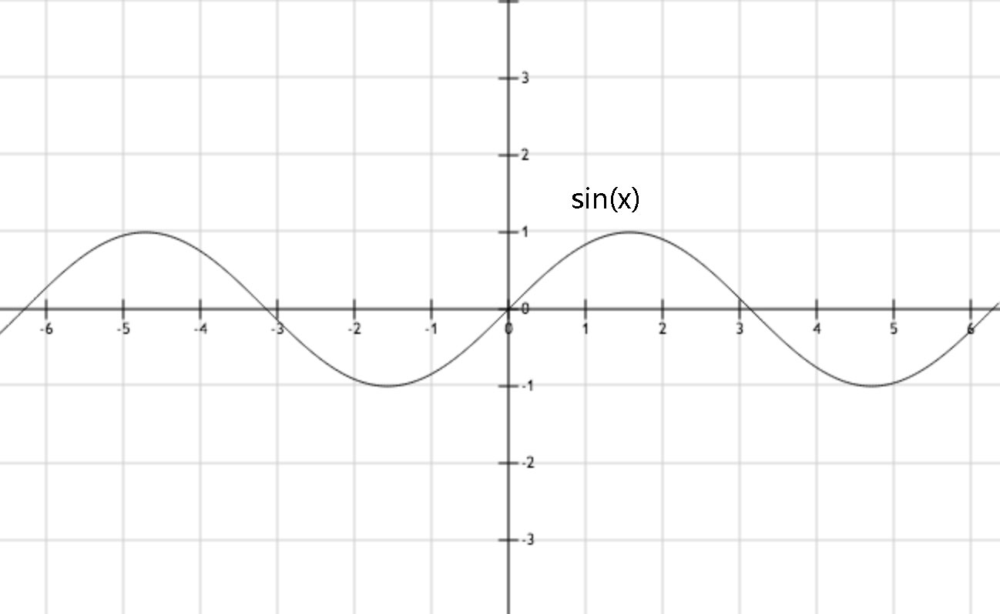
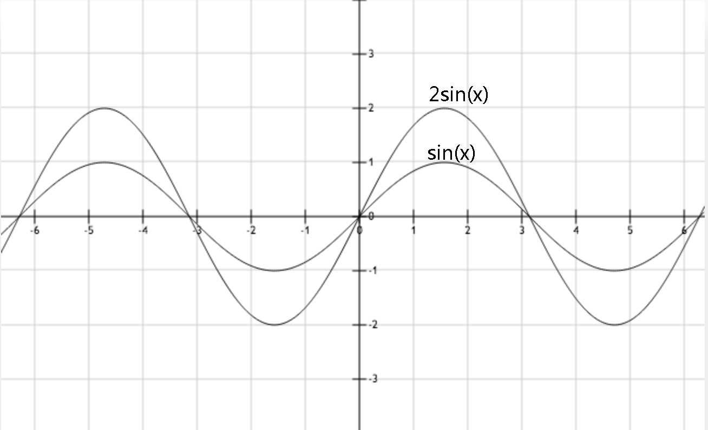
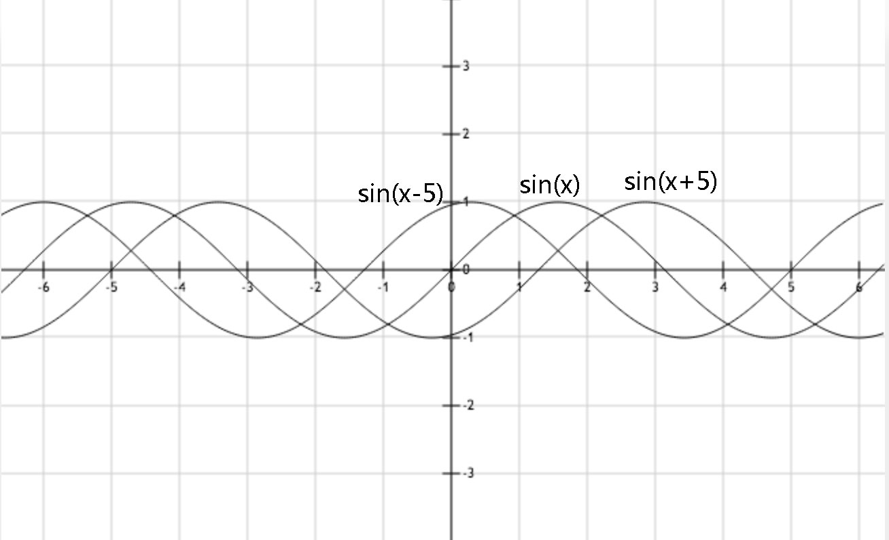
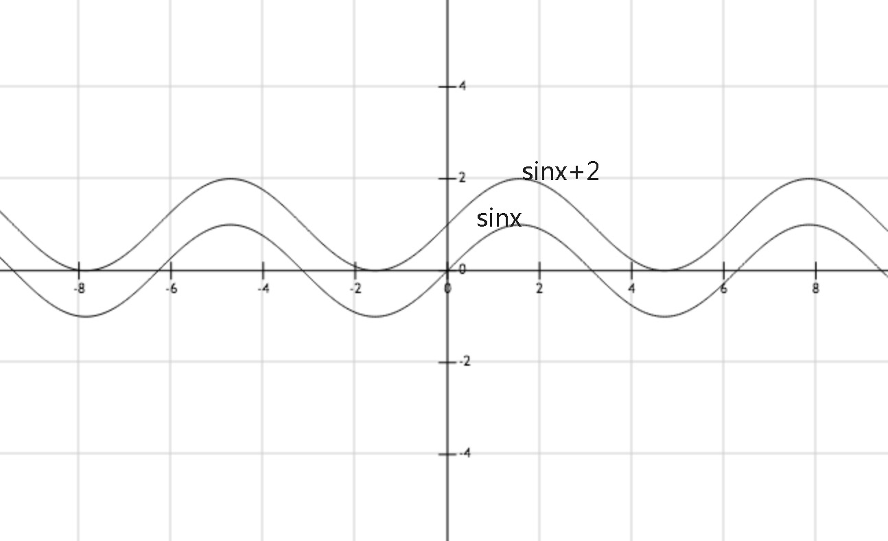
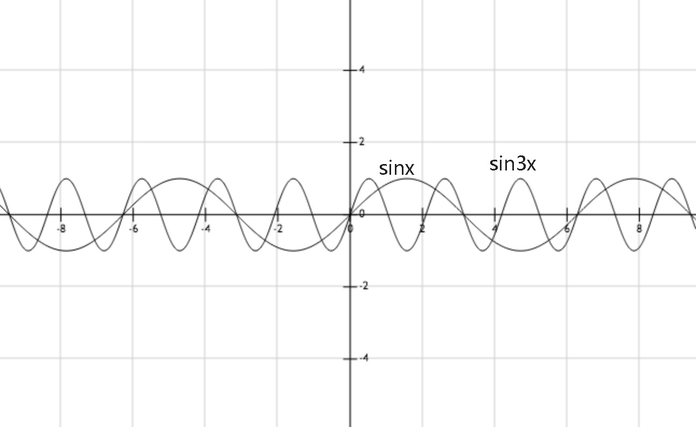
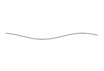
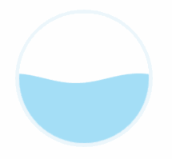
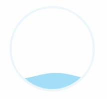
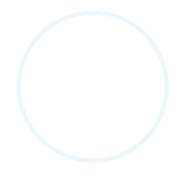

title: 水波纹进度条实现原理
date: 2018-08-01 20:45:16
tags:
---


项目中使用水波纹进度条，可以让项目的预加载更加生动，用户等待阶段相对也没那么无聊～～

本项目中使用Canvas模拟水波纹滚动效果来实现，主要原理是数学的正弦曲线。

## 原理

水波纹外形上酷似正弦曲线，于是通过正弦曲线去分析水波纹的实现原理。



> 正弦曲线公式为`y=Asin(ωx+φ)+k`

A为振幅，改变该值，可改变水波纹波浪的深度，A越大，水波纹越陡，A越小，水波纹越平。



φ为出相，改变该值，可改变水波纹水平方向的位置，φ为正数，水波纹向右移动，φ为负数，水波纹向左移动。



k为偏距，改变改值，可改变水波纹垂直方向的位置。



ω为角速度，改变改值，可改变水波纹波浪的宽度，ω越大，水波纹越窄，ω越小，水波纹越宽。



通过正弦曲线的原理，水波纹进度条由下往上移动，可以通过增大k向上移动实现，水波纹的滚动可以通过φ从右至左移动，水波纹的形状由正弦曲线形成。

## 实现

** 1.画出波浪线 **

``` javascript

var wave = {
    init : function(){
        var canvas = document.getElementById('canvas'),
            winW = document.body.clientWidth;
        
        this.ctx = canvas.getContext('2d');
        canvas.width = winW * 0.6;
        canvas.height = winW * 0.6;

        this.canvasW = canvas.width;

        this.draw()
    },

    //所有绘制
    draw : function(){

        this.drawWave(this.ctx);

    },

    //画波浪线
    drawWave : function(ctx){
        var canvasW = this.canvasW,
            startX = 0,     //波浪线初始x轴坐标
            waveH = 6,      //波浪深度
            waveW = 0.04,   //波浪宽度
            offsetY = canvasW*0.5;     //波浪垂直距离

        ctx.beginPath();
        
        for(var x = startX ; x < canvasW ; x += 20 / canvasW){
            //正弦曲线公式：y=Asin(ωx+φ)+k
            var y = waveH * Math.sin((startX + x) * waveW) + offsetY;   
            points.push([x ,y]);
            ctx.lineTo(x , y);
        }
        ctx.stroke();
    }
}
wave.init()

```
根据想要的效果设定波浪深度`waveH`、波浪宽度`waveW`。


** 2.添加波浪流动效果 **

```javascript
var wave = {
    speed : 50 ,   //波浪横向流动速度
    offsetX : 0 ,   //波浪横向偏移量
    init : function(){
        ...
    },

    //所有绘制
    draw : function(){

        this.ctx.clearRect(0,0,this.canvasW,this.canvasW);
        this.offsetX += this.speed;

        this.drawWave(this.ctx);

        requestAnimationFrame(this.draw.bind(this));
    },

    //画波浪线
    drawWave : function(ctx){
        ...
        
        for(var x = startX ; x < canvasW ; x += 20 / canvasW){
            //正弦曲线公式：y=Asin(ωx+φ)+k
            var y = waveH * Math.sin((startX + x) * waveW + this.offsetX) + offsetY;   
            ctx.lineTo(x , y);
        }
        ctx.stroke();
    }
}
wave.init()
```

通过波浪快速水平滑动，做出波浪流动效果。通过循环修改`φ`即`offsetX`，移动波浪线。每次循环绘制波浪线前需要清除画板`this.ctx.clearRect(0,0,this.canvasW,this.canvasW);`，重新绘制波浪线。



** 3.雏形 **

画出水波纹进度条整体雏形，添加色彩～

```javascript
var wave = {
    ...
    isDrawContainer : false,        //判断是否画了容器
    init : function(){
        ...
    },

    //所有绘制
    draw : function(){
        ...

        if(!this.isDrawContainer){
            this.drawContainer(ctx);
        }

        ...
    },

    drawContainer : function(ctx){
        var pointR = this.canvasW / 2,
            lineWidth = 10 ,
            circleR = pointR - (lineWidth);

        ctx.lineWidth = lineWidth;
        ctx.beginPath();
        ctx.arc(pointR,pointR,circleR,0,2 * Math.PI);
        ctx.strokeStyle = 'rgba(192,225,242,0.3)';
        ctx.stroke();
        ctx.clip();
        this.isDrawContainer = true;
    },

    //画波浪线
    drawWave : function(ctx){
        ...
        //画出完整的波浪形状
        ctx.lineTo(canvasW , canvasW);
        ctx.lineTo(startX , canvasW);
        ctx.lineTo(startPos[0] , startPos[1]);
        ctx.fillStyle = '#a4def6';
        ctx.fill();
    }
}
wave.init()
```
通过｀drawContainer｀函数画出滚动条容器，并剪切出需要的区域，通过`isDrawContainer`判断，优化性能。



** 4.添加波浪溢满效果 **

可以通过偏距`k`即`offsetY`来移动波浪的垂直方向的高度，但由于canvas的y轴方向与正弦曲线的y轴相反，填充的方向相同，故在本例子中，通过修改y轴初始值来实现该效果。

```javascript
var wave = {
    offsetYRange : 1.1 ,            //波浪垂直方向最大范围
    offsetY : 0,                    //波浪垂直方向位移
    ...

    //所有绘制
    draw : function(){
        ...

        if(this.offsetY < this.offsetYRange){
            this.offsetY += 0.003;
        }
        ...
    },
        ...

    //画波浪线
    drawWave : function(ctx){
        ...
        
        for(var x = startX ; x < canvasW ; x += 20 / canvasW){
            //正弦曲线公式：y=Asin(ωx+φ)+k
            var y = (1-this.offsetY) * canvasW + waveH * Math.sin((startX + x) * waveW + this.offsetX); 
            ...
        }
        ...    }
}
wave.init()

```



** 5.添加海浪真实感 **

通过添加多一条颜色深的波浪来实现海浪真实感。

```javascript
var wave = {
    ...

    //所有绘制
    draw : function(){
        ...

        this.drawWave(ctx , this.offsetX , this.offsetY , 0.04 , 6 , '#a4def6');
        this.drawWave(ctx , this.offsetX + 2 , this.offsetY  - 0.02, 0.04 , 8, '#79d4f9');

        ...
    },

    ...

    //画波浪线
    drawWave : function(ctx , offsetX , offsetY , waveW , waveH , color){
        var canvasW = this.canvasW,
            startX = 0;     //波浪线初始x轴坐标

        ctx.beginPath();

        var startPos = [startX];
        
        for(var x = startX ; x < canvasW ; x += 20 / canvasW){
            //正弦曲线公式：y=Asin(ωx+φ)+k
            var y = (1 - offsetY) * canvasW + waveH * Math.sin((startX + x) * waveW + offsetX); 

            ...
        }
        ...
    }
}
wave.init()
```

波浪数据通过多次测试出最佳效果而得出。



** 6.添加进度数据 **

```
var wave = {
    ...
    offsetYSpeed : 0.003,            //波浪溢满
    progressNum : 0,                    //进度
    ...

    //所有绘制
    draw : function(){
        ...

        if(this.offsetY < this.offsetYRange){
            this.offsetY += this.offsetYSpeed;

            this.progressNum += 100/(this.offsetYRange/this.offsetYSpeed);

            document.querySelector('.proNum').innerHTML = parseInt(this.progressNum) + '%';
        }

        ...
    },

    ...
}
wave.init()

```

最终效果如下：


源码：[https://github.com/ZENGzoe/wave-progress](https://github.com/ZENGzoe/wave-progress)


