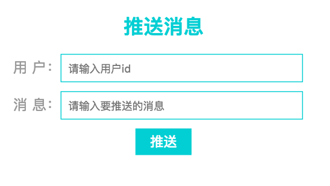
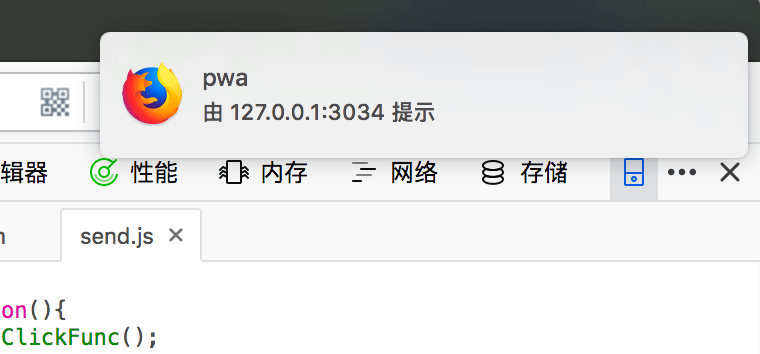
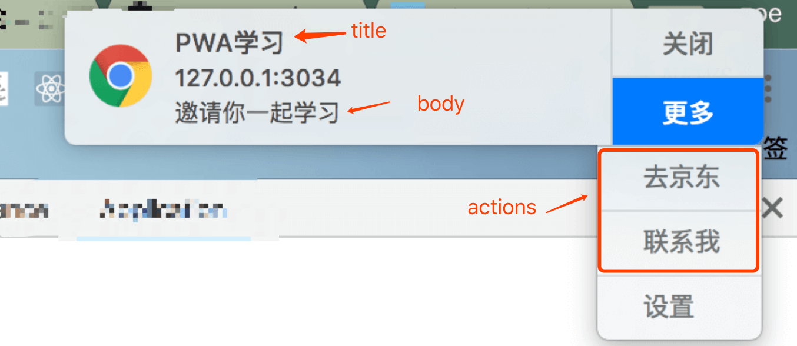

title: PWA学习总结
date: 2018-08-12 12:14:00
tags:
---


[一、PWA是什么](#一、PWA是什么)
[二、PWA的技术](#二、PWA的技术)
[三、添加至桌面](#三、添加至桌面)
[四、离线缓存](#四、离线缓存)
[五、消息推送和提醒](#五、消息推送和提醒)
[六、后台数据同步](#六、后台数据同步)
[七、总结](#七、总结)
[参考文档](#八、参考文档)

demo:新闻搜索demo [(https://github.com/ZENGzoe/pwa-exercise/tree/master)](https://github.com/ZENGzoe/pwa-exercise/tree/master)

# 一、PWA是什么

PWA（Progress Web Apps）即渐进式网页应用，可以让用户在使用web页面的时候如同使用App，大大的提升了web页面的性能和体验。

</br>

# 二、PWA的技术

PWA不是一项技术，而是一系列技术的集合。

从上图可以看出，PWA中一系列的技术包括了Service worker、Manifest、Push、Notification、Sync等，其中Service worker技术较强大，大部分的功能都要基于它实现。

PWA可以实现添加至桌面、离线缓存、消息推送和提醒、后台同步数据等功能，使得web应用更加接近原生App。

<br/>

# 三、添加至桌面

将web应用添加至桌面，启动时，可实现主屏幕即打开的原生app体验。

PWA中实现添加至桌面的功能通过,Manifest实现，通过一个json文件，就可配置web应用添加至桌面的标题、icon、描述、展示模式等。

<br/>

##### 3.1. 配置manifest.json

以下为manifest.json例子：

```json
{
    "name" : "新闻搜索",
    "short_name" : "news",
    "start_url" : "/",
    "display" : "standalone",       
    "background_color" : "#02cfd4",
    "description" : "可以用于新闻搜索的小应用",
    "theme_color" : "#02cfd4",
    "orientation" : "portrait-primary",
    "icons" : [
        {
            "src" : "img/icon_32.png",
            "sizes" : "32x32",
            "type" : "image/png"
        },{
            "src" : "img/icon_72.png",
            "sizes" : "72x72",
            "type" : "image/png"
        },{
            "src" : "img/icon_128.png",
            "sizes" : "128x128",
            "type" : "image/png"
        },{
            "src" : "img/icon_144.png",
            "sizes" : "144x144",
            "type" : "image/png"
        },{
            "src" : "img/icon_192.png",
            "sizes" : "192x192",
            "type" : "image/png"
        },{
            "src" : "img/icon_256.png",
            "sizes" : "256x256",
            "type" : "image/png"
        },{
            "src" : "img/icon_512.png",
            "sizes" : "512x512",
            "type" : "image/png"
        }
    ] 
}
```

配置解释：

`name` : 打开桌面web应用时，启动页的标题
`short_name` : 添加至桌面应用的名称
`start_url` : 桌面应用打开的地址，如设置为'/'，为manifest.json当前路径的index.html
`display` : 桌面应用打开后展示的模式，有四种模式：fullscreen、standalone、minimal-ui、browser
    -`fullscreen`模式 : 页面占满整个屏幕
    -`standalone`模式 : 此模式比较相似在app打开，与全屏模式相比，展示手机屏幕顶部信息时间、电量等信息栏。
    -`minimal-ui`模式 : 与standalone模式相比，多出浏览器地址栏
    -`browser`模式 : 浏览器模式，与浏览器打开一致


其中，部分Android手机Chrome浏览器能够兼容四种模式，部分Android手机Chrome浏览器目前只兼容standalone和browser模式，fullscreen和minimal-ui则向下兼容为standalone和browser模式。

`background_color` : 启动页背景颜色
`description` : web应用描述
`theme_color` : 打开桌面应用，地址栏、信息栏主题颜色,可看上图的standalone和minimal-ui模式
`orientation` : 指定页面的展示方向，会根据不同设备横竖屏的角度去定义。
    -`portrait`｜`portrait-primary`｜`portrait-secondary` : 竖屏
    -`portrait`｜`portrait-primary`｜`portrait-seconday` : 横屏
    -`natural` :  设备屏幕旋转角度为0° 对应的方向
    -`any` : 可根据设备屏幕角度旋转页面
`icons` : 桌面应用icon图、开启页展示图，数组格式，浏览器会选择适合的尺寸作为icon图
    -`src` : icon地址
    -`sizes` : icon尺寸，单位为px，格式为宽x高
    -`type` : icon格式，如png为image/png、jpg为image/jpg、jpeg为image/jpeg

<br/>

##### 3.2. 引入manifest.json

配置完manifest.json后，在index.html中链入：

```html
<link rel="manifest" href="manifest.json">
```

只需要以上两步，就可以实现页面添加至桌面的功能。

<br/>

##### 3.3. 兼容性

Manifest兼容性可以在[caniuse.com](https://caniuse.com/#search=manifest)查看：


目前Android的Chrome浏览器和UC支持Manifest，而iOS要在11.4以上版本才支持。

<br/>

# 四、离线缓存

缓存web的资源，当用户再次访问页面时，可以优先从缓存中读取数据渲染页面，提升访问速度。在无网络的环境下，也可以继续访问web页面。比如当缓存了h5小游戏，可随时随地离线刷游戏。实现离线缓存，需要Service Worker和Cache API的结合。

<br/>

#### 4.1. Service Worker介绍

Service Worker：服务工作线程，是浏览器在后台独立于网页运行的脚本。因此Service Worker的运行不会阻塞js脚本的运行。除了可以实现离线缓存，Service Worker在消息推送、后台同步等功能中都扮演着重要的角色，详细的api将会随着余下章节介绍。

使用Service Worker，可以拦截请求，具有一定的安全性问题，因此项目部署发布时，Service Worker只能HTTPS域下内使用。为了方便开发调试，规定还可在`localhost`或`127.0.0.1`下使用。

Service Worker有自己的生命周期，当在Javascript注册Service Worker后，Service Worker的生命周期开始。

Service Worker生命周期：installing（安装中） -> installed（安装后） -> activating（激活中） -> activated（激活后） -> redunbant（无用）。

**installing阶段：** 通常用来缓存资源。

`event.waitUntil()` : 参数为一个promise，在该promise中进行资源的缓存，缓存资源成功则安装成功，缓存资源失败则安装失败。

`self.skipWaiting()` : 可跳过安装等待阶段，直接进入激活阶段，加快工作进程。

**installed阶段：** 表示Service Worker安装成功。

**activating阶段：** 通常用来清除旧缓存。

`event.waitUntil()` : 参数为一个promise，在该promise中清除旧缓存。

`self.client.claim()` : 控制未受控制的客户端。默认情况下，安装Service Worker之后，需要刷新页面才能有Service Worker系列操作，执行该方法，可改变该默认情况，无需重新刷新页面。

**activated阶段：** 表示Service Worker可以控制客户端。

**redunbant阶段：** 无用阶段。当Service Worker install失败、activate失败或有新的Service Worker代替，则Service Worker变为redunbant。


<br/>

#### 4.2. Cache API介绍

caches是window的属性之一，用于缓存静态资源或请求返回的数据。

主要的缓存数据来源：
1.Service Sorker的install事件中缓存静态资源，比如缓存html、css、js等静态资源
2.Service Worker的fetch事件中缓存请求的数据
3.用户交互请求的数据，比如查看某些图片、视频等

使用caches之前，需要判断浏览器是否支持：

```
if('caches' in window){
    //支持
}
```

**Caches API：**

1.创建或打开cache

如果缓存中存在cacheName则直接打开，不存在则创建新的cacheName。

```
caches.open(cacheName)  //自定义cacheName
```

返回一个promise，对cacheName的存储、删除等操作需要在返回的promise中进行。

2.缓存数据

（1）`add(url)`：缓存单个静态数据，参数为静态数据路径。路径错误，则缓存失败。

```
caches.open(cacheName).then(cache => {
    cache.add('./index.js')
})
```

（2）`allAll(urlArray)`：缓存多个静态数据，参数为静态数据路径的数组。如果数组中某一项的路径错误，整个数组的静态数据缓存失败。

```
caches.open(cacheName).then(cache => {
    cache.add([
        '/',
        './index.html',
        './js/index.js',
        './css/index.css',
    ])
})
```

（3）`put(request,response)`：缓存请求的数据，第一个参数为请求的url，第二个参数为请求返回数据。

```
fetch(url).then(response => {
    cache.put(url,response)
}) 
```

3.查找缓存

缓存的查找是根据cacheName中的请求进行查找。

（1）`match(request,options)` : 查找第一个匹配的缓存。

第一个参数为需要匹配的请求，第二个参数为请求的过滤：

`ignoreSearch` ：Boolean值，默认值为false，当设置为true，则过滤掉hash，如请求为`http://xxx.com?q=xxx`将会被过滤掉。
`ignoreMethod` ：Boolean值，默认值为false，当设置为true，则阻止对request请求的http方法的验证（通常只允许GET和HEAD两种请求方法）。
`ignoreVary` ：Boolean值，默认值为false，当设置为true，则忽略对VARY头信息的匹配。如当请求的request匹配成功，对与获取的response值，不会进行VARY头信息的匹配。
`cacheName` ：缓存名，一般忽略。

如果不匹配，则返回undefined。匹配成功，则返回带有reponse的promise。

```
caches.open(cacheName).then(cache => {
    cache.match('./index.js').then(function(response){
        //response为返回结果
    })
})
```

（2）`matchAll(request,options)` ：查找全部匹配的缓存。参数和返回结果同`match`。

4.删除缓存 

`delete(key)` : 删除流程为找到匹配的缓存并删除，返回的结果为promise。

```
caches.open(cacheName).then(function(cache) {
  cache.matchAll('./images/').then(function(response) {
    response.forEach(function(element, index, array) {
      cache.delete(element);
    });
  });
})
```

5.遍历缓存

遍历所有的缓存,参数同match，非必参，当为传入参数，则返回所有的缓存。

```
caches.keys(request,options).then(function(keys){
    //返回的keys为数组
})
```

<br/>

#### 4.3. 离线缓存实践

Service Worker可以监听web发出的请求，同时作为代理，向服务器发起请求，并判断是否需要使用缓存作为web的请求返回。


如果缓存中存在请求的数据，则Service Worker不发起请求，直接返回缓存。如果缓存中不存在请求的数据，则Service Worker代理发起请求，缓存数据，并返回浏览器数据。

<br/>

##### 4.3.1. 注册Service worker

使用Service Worker第一步，创建serviceWorker.js，并在js中注册Service Worker

```javascript
//index.js
//判断是否支持serviceWorker
if('serviceWorker' in navigator){
    //serviceWorker.js后缀为随机戳，方便更新serviceWorker.js
    navigator.serviceWorker.register('./serviceWorker.js', { scope : '/'}).then(function(){
        console.log('service worker注册成功');
    })
}
```

使用`navigator.serviceWorker.register(url,scope)`注册Service Worker，第一个参数为`serviceWorker.js`的地址，第二个参数`scope`为缓存文件的范围，最大范围是`serviceWorker.js`所在的当前目录，范围的设定只能为`serviceWorker.js`同目录或子目录，比如`serviceWorker.js`的路径为`app/public/`，子文件有`img`，范围可以设定为同目录`/`或子目录`/img/`，不能设为`app/static/`等非同目录和子目录，因此需要将`serviceWorker.js`放在需要缓存的文件的最外层路径里。当第二个参数为空时，默认是范围是同目录范围，即`/`。

<br/>

##### 4.3.2. 缓存静态资源

1.缓存静态数据，在install事件中缓存

```javascript
//serviceWorker.js

var cacheName = 'news-v1',  //唯一的缓存名
    cacheFiles = [          //需要缓存的静态文件地址
        '/',
        './index.html',
        './js/index.js',
        './css/index.css',
        './img/white.jpg'
    ];

    //监听service worker安装事件，在install事件中缓存静态文件
self.addEventListener('install', function(e){
    console.log('install');
    //在安装前执行
    e.waitUntil(
        //存储
        caches.open(cacheName).then(function(cache){
            return cache.addAll(cacheFiles);
        })
    )
})
```

2.使用缓存的静态文件

```javascript
//serviceworker.js

//监听客户端所有的请求
self.addEventListener('fetch' , function(e){
    e.respondWith(
        caches.match(e.request).then(function(cache){
            //如果缓存中有匹配的请求，返回缓存的静态资源
            return cache || fetch(e.request)
        }).catch(function(err){
            //没有缓存
            console.log('err',err);
            return fetch(e.request)
        })
    )
})
```

添加上面的代码后，就可以在离线的状态下继续访问页面。

<br/>

##### 4.3.3. 缓存API请求

除了静态资源，还可以缓存动态请求的数据，动态请求的数据与静态数据的差异在于如果本地缓存中有请求的缓存，在服务器请求未返回前使用缓存的数据，服务器请求返回后，更新数据。

在demo中的缓存搜索新闻的请求：

1.缓存搜索api的数据

在fetch事件中缓存动态请求的数据

```javascript
//serviceWorker.js
var fetchCacheName = 'news-api-v1', //唯一的缓存名
    cacheFetchUrls = [      //缓存的api
        '/news?'
    ];

self.addEventListener('fetch' , function(e){
    //判断请求是否需要缓存
    var needCache = cacheFetchUrls.some(function(url){
        return e.request.url.indexOf(url) > 1;
    })
    if(needCache){
        caches.open(fetchCacheName).then(function(cache){
            return fetch(e.request).then(function(response){
                //缓存请求
                if(response.statusText !== 'Not Found'){
                    cache.put(e.request.url,response.clone())
                }
                return response;
            })
        })
    }
})
```

由于内存效率问题，请求的response流只能读一次，如果直接执行`cache.put(request, response)`将response流存入内存中，将不能返回给浏览器，因此需要将response复制再存储。详细介绍可参考[What happens when you read a response?](https://jakearchibald.com/2014/reading-responses/)

2.从缓存中读取

```javascript
//index.js
getDataFromCache : function(url){
    if('caches' in window){
        return caches.match(url).then(function(cache){
            if(!cache || cache.responseText == 'Not Found'){
                return;
            }
            //如果缓存中有匹配的请求，返回数据
            return cache.json();
        })
    }else{
        return Promise.resolve();
    }
}
```

封装从缓存中搜索匹配的请求，如匹配成功，返回缓存的数据。

3.请求数据

请求数据，当数据未返回时，优先展示缓存中的数据，数据返回后，当新数据和缓存数据不同时，重新更新数据，并缓存新数据。

```javascript
//index.js
queryNews : function(){
    var _this = this,
        newsName = document.querySelector('#input').value;
        url = '/news?q=' + newsName;    //搜索新闻接口
    
    if(newsName === ''){
        alert('请输入想要了解的新闻');
        return;
    }

    var fetchData = _this.fetchNewsApi(url);        //fetch搜索新闻接口
    var cacheData;
    
    //缓存中匹配请求
    _this.getDataFromCache(url).then(function(data){
        //匹配成功
        if(data && data.data &&  data.data.length > 0){
            _this.fillNews(data.data)
        }
        cacheData = data || {};
        return fetchData;
    }).then(function(data){
        //请求成功，重新渲染数据
        if(JSON.stringify(data) !== JSON.stringify(cacheData)){
            _this.fillNews(data.data)
        }
    }).catch(function(err){
        console.log(err);
    }) 
}
```

当断网后，就可以继续搜索同样的新闻～

<br/>

##### 4.3.4. 更新缓存

当修改代码时，需要客户端更新数据，可通过两种方法：

1.url加时间戳或随机数戳

如注册Service Worker中serviceworker.js后面添加的戳

2.修改cacheName，并删除无用的cacheName

在activate事件中删除无用缓存

```
//serviceWorker.js
//监听激活事件，删除无用的缓存
self.addEventListener('activate', function(e){
    //在激活前之行
    e.waitUntil(
        caches.keys().then(function(keys){
            return Promise().all(keys.map(function(key){
                //通过修改cacheName来更新缓存，并删掉无用缓存
                if(key !== cacheName){
                    return caches.delete(key)
                }
            }))
        })
    )
    return self.clients.claim();
})
```

<br/>

#### 4.3. 兼容性

从caniuse中查看[Service Worker](https://caniuse.com/#search=service%20workers)的兼容性：


大部分主流浏览器支持Service Worker，苹果从ios11.4的系统版本中也开始支持Service Worker。

<br/>

# 五、消息推送和提醒

消息推送和提醒可以说是App常规的功能，在自己的web应用中加入消息推送和提醒功能，可以让我们的页面更接近APP。消息推送和提醒的技术实现基于Service Worker，因此在页面没有打开的情况下也能消息提醒进行操作。

消息推送和提醒使用不同的API实现，分别是push API和notification API，push可以让服务器发送消息给Service Worker，notification可以给用户显示提醒信息。

<br/>

#### 5.1. Push

消息推送流程比较复杂，在消息推送过程中还需要保证传递的信息的安全性，具体内容请往下看。

<br/>

##### 5.1.1. 推送消息的三个流程

在开始使用push API之前，需要了解消息推送的工作流程。主要由三个部分组成：

1.客户端订阅消息推送
2.服务器端推送消息给浏览器
3.Service Worker接收消息

下面是关于这三部分的详细介绍。

<br/>

##### 5.1.2. 客户端订阅消息推送

消息推送的第一步是订阅，订阅又分为三部分：

（1）向用户请求消息推送
（2）向push service发送订阅消息
（3）将PushSubscription发送至服务器


</br>

**（1）向用户请求消息推送：**

通过向用户弹出推送请求弹窗向用户请求：


实现方法通过`Notification.requestPermission()`:

```javascript
//index.js
function askPermission(){
    return new Promise(function(resolve , reject){
        var permissionResult = Notification.requestPermission(function(result){
            //旧版本
            resolve(result);
        })
        if(permissionResult){
            //新版本
            permissionResult.then(resolve , reject);
        }
    }).then(function(permissionResult){
        if(permissionResult !== 'granted'){
            throw new Error('We weren\'t granted permission.');
        }
    })
}
```

新的语法会返回一个promise处理请求结果，旧版本则通过回调函数处理，因此需要同时处理这两种情况。

`permissionResult`返回结果有三种，`granted`、`denied`、`default`，`granted`为允许，`denied`为禁止，`default`为默认浏览器处理结果。

在注册Service Worker成功后进行推送的请求：

```javascript
//index.js 
//在使用之前还需判断是否支持PushManager
if('serviceWorker' in navigator && 'PushManager' in window){
    navigator.serviceWorker.register('./serviceWorker.js').then(function(registration){
        return Promise.all([
            registration,
            askPermission()
        ])
    }).then(function(result){
        ...
    })
}
```

加上上面的代码之后，刷新页面就会出现推送请求的弹窗：


当用户点击之后，无论用户选择什么，浏览器后记住用户的操作，再次访问时，不会再弹出该窗口，即该窗口指出现一次。

</br>

**（2）向push service发送订阅消息**

应用服务钥匙有一个公钥和一个私钥，私钥用于服务器，公钥用于push service。在订阅消息时，需要将公钥发送给push service。push service创建`endpoint`传递给浏览器，浏览器将`endpoint`加到`PushScription`，通过`subsribe()`的`promise`返回，这就是发送订阅消息的过程。


**push service**的功能是接收请求，验证并发送消息至指定的页面，操控消息的接收和推送。甚至在页面断网时，将会继续等待直到浏览器联网时推送消息。push service存在浏览器中，每个浏览器都会使用不同的push service，庆幸的是，push service遵循[Web Push Protocal](https://tools.ietf.org/html/draft-ietf-webpush-protocol-12)，使用相同的API，就可以在不同的push service通用。

**PushSubscription**可作为一个用户的id信息，包含了订阅的所有信息，例如：


上图中的`endpoint`中可以得出该浏览器使用的push service是`fcm.googleapis.com`，`eq2HeeL0Mcs...`是指向的用户。

公钥和私钥的创建可以通过`web-push`：

```
npm install -g web-push
web-push generate-vapid-keys
```

向push service发送订阅信息通过`registration.pushManager.subscribe()`发送，需要向`subscribe()`传入一个对象，该对象中包含`userVisibleOnly`和`applicationServerKey`。

**userVisibleOnly**：boolean值，标志消息的推送通过发送消息提醒用户，还是在后台默默的发送不提醒用户。部分浏览器只支持`userVisibleOnly`为`true`，如果设置为`false`或不设置，浏览器报错。


**applicationServerKey**：客户端的公钥，要求Unit8Array类型。

```javascript
//index.js 
function subscribeUserToPush(registration , publicKey){
    var subscribeOptions = {
        userVisibleOnly : true,
        applicationServerKey : window.urlBase64ToUint8Array(publicKey)
    };
    return registration.pushManager.subscribe(subscribeOptions).then(function(pushSubscription){
        console.log('pushscription' ,pushSubscription)
        return pushSubscription;
    })
}
```
`applicationServerKey`要求参数是Unit8Array类型，而创建的公钥是base64类型，因此使用`urlBase64ToUint8Array`方法将base64转为Unit8Array。`urlBase64ToUint8Array`方法来自[base64util.js](https://github.com/alienzhou/learning-pwa/blob/push/public/base64util.js)。

在请求推送消息用户允许后发送订阅信息：

```javascript
//index.js
if('serviceWorker' in navigator && 'PushManager' in window){
    //公钥
    var publicKey = 'BBP3Ni05GCu_RTb7rAkOqfFPiDQkNhcAfOAhqxpaxmuKLhF3DYTldbl3vrmfTfHSHhCBXPgKhQXexEmDLLqV1sQ';
    
    navigator.serviceWorker.register('./serviceWorker.js').then(function(registration){
        return Promise.all([
            registration,
            askPermission()
        ])
    }).then(function(result){
        var registration = result[0];

        return subscribeUserToPush(registration,publicKey)
    })
```

</br>

**（3）将PushSubscription发送至服务器**

拿到`PushSubscription`后，将`PushSubscription`发送到后台服务器，后台服务器将会存储该用户的信息，并通过`PushSubscription`来推送信息。

假设服务器端用Nodejs已经实现接收并存储`PushSubscription`的接口`/subscription`，具体实现可查看[源码](https://github.com/ZENGzoe/pwa-exercise/blob/master/app.js)。

```javascript
//index.js
//将PushSubscription发送至服务器
function sendSubscriptionToServer(body){
    var url = '/subscription';
    return new Promise(function(resolve , reject){
        var xhr = new XMLHttpRequest();
        xhr.timeout = 7000;
        xhr.onreadystatechange = function(){
            var response = {};
            if(xhr.readyState == 4 && xhr.status == 200){
                try{
                    response = JSON.parse(xhr.responseText);
                }catch(e){
                    response = xhr.responseText
                }
                resolve(response)
            }else if(xhr.readyState == 4){
                resolve();
            }
        }
        xhr.onabort = reject;
        xhr.onerror = reject;
        xhr.ontimeout = reject;
        xhr.open('POST' , url , true);
        xhr.setRequestHeader('Content-Type' , 'application/json');
        xhr.send(body)
    })
}

```

在获得`subscription`后发送至服务器：

```
if('serviceWorker' in navigator && 'PushManager' in window){
    ...

    navigator.serviceWorker.register('./serviceWorker.js').then(function(registration){
        ...
    }).then(function(result){
        ...
    }).then(function(subscription){
        var body = {subscription : subscription};

        body.uniqueid = new Date().getTime();   //为方便服务器推送消息至指定的客户端
        console.log('uniqueid' , body.uniqueid);

        return sendSubscriptionToServer(JSON.stringify(body));
    }).then(function(res){
        console.log(res)
    }).catch(function(e){
        console.log(e)
    })
```

给每个打开的页面都设定唯一的`uniqueid`，方便服务器对特定的客户端推送消息。

</br>

##### 5.1.3. 服务器端推送消息给浏览器

服务器端发送消息给浏览器需要保证信息的安全性，那么这就需要公钥私钥来保证信息的安全性。上文也提到私钥用户服务器，公钥用于push service,那么公钥私钥的使用逻辑如下：


（1）服务器用私钥对验证头签名
（2）服务器将用私钥签名了的消息发送至对应的push service
（3）push service收到消息后，用公钥验证解密
（4）push service确认验证通过无误，告诉服务器验证通过
（5）push service将消息发送至正确的客户端

由于消息推送的流程过于复杂，较难定位出现的问题，因此推荐使用[web push](https://github.com/web-push-libs/web-push)这个库进行消息加密、格式化和触发Service Worker的`push`事件。

```javascript
//app.js
var webpush = require('web-push');
```

由于服务器需要使用私钥，因此需要在`web-push`设置应用服务钥匙：

```javascript
//app.js

//先前生成的公钥和私钥
var vapidKeys = {
    privateKey:"9mHKxhF60T4iApR4f4dDKtdXL8PK5dj3TfDBAK8iufI",
    publicKey:"BBP3Ni05GCu_RTb7rAkOqfFPiDQkNhcAfOAhqxpaxmuKLhF3DYTldbl3vrmfTfHSHhCBXPgKhQXexEmDLLqV1sQ"
}

webpush.setVapidDetails(
    'mailto:563282341@qq.com',
    vapidKeys.publicKey,
    vapidKeys.privateKey
)
```
`web push`要求传入发送者的邮箱，为了能够方便地联系到发送者传递有用的信息。

在服务器端，我们使用`/push`路由，向客户端发送消息推送：

```nodejs
router.post('/push' , koaBody() , async ctx => {
    let { uniqueid , payload } = ctx.request.body;
    let list = uniqueid ? await util.find({uniqueid}) : await util.findAll();   //查找指定的用户
    let status = list.length > 0 ? 0 : -1;

    for(let i = 0 ; i < list.length ; i++){
        let subscription = list[i].subscription;
        pushMessage(subscription , JSON.stringify(payload));
    }

    ctx.response.body = {
        status
    }
})
```
在demo中，使用了`nedb`数据库存储用户的`pushSubscription`，详细实现代码可以查看[源码](https://github.com/ZENGzoe/pwa-exercise/blob/master/util.js)

在`pushMessage`方法中使用了`web-push`的`sendNotification`方法推送消息：

```javascript
//app.js
function pushMessage(subscription , data = {}){
    webpush.sendNotification(subscription , data , options).then(data => {
        console.log('push service的相应数据' , JSON.stringify(data));
        return;
    }).catch(err => {
        //410和404表示subscription过期不再有效
        if(err.statusCode === 410 || err.statusCode === 404){
            console.log(err);
            return util.remove(subscription)
        }else{
            console.log(subscription);
            console.log(err);
        }
    })
}
```

`webpush.sendNotification`推送消息的事件能被客户端的`push`事件捕获。

<br/>

##### 5.1.4. Service Worker接收消息

服务器推送消息至push service，push service再推送消息给用户，因此服务器发送的消息先是被Service Worker的`push`事件捕获。

```javascript
//serviceWorker.js
self.addEventListener('push' , function(e){
    var data = e.data;
    if(data){
        self.registration.showNotification(data);
    }else{
        console.log('push没有任何数据')
    }
})
```

`self`指向的是`serviceWorker`，push service通过`self.registration.showNotification`方法向用户发送提醒。

这就是消息推送的三大流程，到这里就可以直接给用户推送消息。可以新建一个后台页面进行消息推送，也可以使用[postman](https://www.getpostman.com/)模拟后台推送消息。在demo中，我简单地搭了一个后台页面：



用户id指的是打开页面时生成的uniqueid，输入用户id和要传送的消息后，点击推送，就会收到推送消息。



由于chrome浏览器的`push service`是FCM，需要翻墙和配置[firbase](https://console.firebase.google.com/)才能使用。firfox浏览器使用的是自家的`push service`，不需要其他操作就可以收到消息推送。

<br/>

#### 5.2. Notification

`Notification`主要是显示提醒界面和对提醒界面的操作。

<br/>

##### 5.2.1. 提醒界面

丰富的提醒界面可以是这样的：


显示提醒界面的接口在5.1.3节中已经使用过：`showNotification(title,options)`，第一个参数`title`很明显是消息界面的标题，第二个参数`options`是消息界面其他相关的配置，例如：

```javascript
 var options = {
    body : '邀请你一起学习，邀请你一起学习邀请你一起学习',     
    icon : '/img/icon_128.png', 
    actions : [{
        action : 'show-jd',
        title : '去京东'
    },{
        action : 'contact-me',
        title : '联系我'
    }],
    tag : 'pwa-starter',
    renotify : true
};
```

`title`、`options`配置对应的消息界面如下：




`title`：标题，不限制字数，当文字过多以省略号显示
`body`：简介，不限制字数，当文字过多以省略号显示
`icon` ： 图片，未规定图片尺寸大小
`actions` ： 新的按钮操作
    -`action` ：按钮的动作函数
    -`title` ：按钮的标题
`tag` ： 消息界面唯一的标志
`renotify` ： 表示是否重复多次显示消息界面，当设为`false`，出现过一次的`tag`消息，将不会再出现

将配置加入`serviceWorker.js`的`push`事件中：

```javascript
//serviceWorker.js

self.addEventListener('push' , function(e){
    var data = e.data;
    if(e.data){
        data = data.json();
        console.log('push的数据为：',data);
        var title = data;
        var options = {
            body : '邀请你一起学习',
            icon : '/img/icon_128.png',
            actions : [{
                action : 'show-jd',
                title : '去京东'
            },{
                action : 'contact-me',
                title : '联系我'
            }],
            tag : 'pwa-starter',
            renotify : true
        };
        self.registration.showNotification(title,options);
    }else{
        console.log('push没有任何数据')
    }
})
```

也可以在`index.js`中通过点击某个按钮直接显示消息提醒，配置相同：

```
//index.js
...
 document.querySelector('.J_notification').addEventListener('click',function(e){
    var title = 'PWA学习';
    var options = {
        ...
    };
    registration.showNotification(title,options)
})
...
```

<br/>

##### 5.2.2. 提醒交互

提醒界面已经出来了，那么怎么去捕获用户在提醒界面上的操作呢。

在Service Worker中，可以通过`notificationclick`去捕获用户的点击。

```
//serviceworker.js
self.addEventListener('notificationclick' , function(e){
    var action = e.action;
    console.log(`action tag:${e.notification.tag}`,`action:${action}`,e);
    switch(action){
        case 'show-jd' : 
            console.log('show-jd');
            break;
        case 'contact-me' :
            console.log('contact-me');
            break;
        default :
            console.log(`未处理的action：${e.action}`);
            action = 'default';
            break;
    }
    e.notification.close(); //关闭通知栏
})
```

在`notificationclick`事件中，可以通过`e.notification.close()`关闭通知栏。还可以获取`action`，那么就可以根据`action`进行不同的操作。在上节中，我们加了`show-jd`和`contact-me`的`action`，那么我们可以这些`action`添加不同的操作，比如点击“去京东”，则新增标签页跳去京东首页，点击“联系我”，则唤起发给我的邮件。

但是Service Worker不能直接操作DOM，我们可以让Service Worker和客户端通信。在Service Worker中可以使用`postMessage`向客户端发送消息，而客户端可以用`message`事件捕获Service Worker发送的消息。

```javascript
//serviceworker.js

self.addEventListener('notificationclick' , function(e){
    var action = e.action;
    ...
    e.waitUntil(
        self.clients.matchAll().then(function(clients){
            clients.forEach(function(client){
                client.postMessage(action);    //向客户端发送用户点击的`action`。
            })
        })
    )

    e.notification.close();
})
```

使用`e.waitUntil`可以在程序繁忙后也能保证将信息发送到客户端。

捕获`service worker`发送的消息：

```javascript
//index.js
navigator.serviceWorker.addEventListener('message', function(e){
    var action = e.data;
    console.log(`用户点击的action是：${e.data}`);
    switch(action){
        case 'show-jd' :
            location.href = 'https://www.jd.com';
            break;
        case 'contact-me' :
            location.href = 'mailto:563282341@qq.com';
            break;
        default :   //点击除show-jd和contact-me区域，显示页面提示
            document.querySelector('.tips').style.display = 'block';
            break;
    }
})
```

还可以点击通知栏时切换到当前客户端标签页，也可以在未打开客户端时，打开客户端标签页：

```javascript
self.addEventListener('notificationclick' , function(e){
    var action = e.action;
    ...
    
    e.waitUntil(
        self.clients.matchAll().then(function(clients){
            if(!clients || clients.length == 0){
                //打开标签页
                self.clients.openWindow && self.clients.openWindow('http://127.0.0.1:3034');
                return;
            }
            //切换到指定客户端页
            clients[0].focus && clients[0].focus();
            ...
        })
    )

    e.notification.close();
})
```

#### 5.3. 兼容性

在caniuse查看[Push API](https://caniuse.com/#search=push)和[Notification API](https://caniuse.com/#search=notification)的兼容性：


1.`Push API`在ios safari不兼容，在Android和pc端兼容性较好。如果浏览器使用的是FCM的`push service`在国内不能使用。

2.`Notification API`在移动端兼容性较差，在pc端得到比较好的支持。其中`actions`目前只在Chrome浏览器支持。


<br/>

# 六、后台数据同步

#### 6.1. 后台同步介绍

当我们在页面进行某个操作，需要将数据提交后台，可能会因为网络慢或无网络，最后用户直接关闭网络，导致数据无法提交到后台，再次进入页面时，还需要重新进行同样的操作。那么后台同步功能的实现就能解决这样的问题，可以将操作保存在Service Worker，在有网络时，Service Worker将用户的操作同步到后台，大大的提升了用户体验。

后台同步的流程如下：
1.在浏览器中发起后台同步请求
2.在Service Worker中监听`sync`事件，并发起请求

接下来我们看看如何实现后台同步。

<br/>

#### 6.2. 实现后台同步

后台同步的实现，需要依赖于Service Worker监听浏览器发起的`sync`后台同步事件：

```javascript
self.addEventListener('sync' , function(e){
    console.log(e)
})
```

除此之外，后台同步还需要使用到`SyncManager`接口，通过`registration.sync`调用，返回包含`getTags`和`register`方法的`SyncManager`对象。

`register(tag)`：发起同步，tag为唯一的同步请求标志，返回一个promise。

`getTags()`：获取所有在SyncManager注册的tag，返回一个promise。

**1.在浏览器中发起后台同步请求**

```javascript
//index.js
if('serviceWorker' in navigator && 'SyncManager' in window){
    //在service worker激活成功后进行
    navigator.serviceWorker.ready.then(function(registration){
        var tag = "sample_sync";
        document.querySelector('.J_sync').addEventListener('click' , function(){
            console.log('同步后台',registration.sync)

            registration.sync.register(tag).then(function(){
                console.log('同步后台已触发',tag);
            }).catch(function(err){
                console.log('后台同步出发失败',err);
            })
        })
    })
}
```

**2.在Service Worker中监听`sync`事件，并发起请求**

假设在Nodejs中已经实现接口`/sync`：

```javascript
//serviceworker.js
self.addEventListener('sync' , function(e){
    var init = {
        method : 'GET'
    };

    if(e.tag === 'sample_sync'){
        var request = new Request(`/sync?name=xxx` , init);
        
        e.waitUntil(
            fetch(request).then(function(response){
                return response;
            })
        )
    }    
})
```

使用`waitUntil`可以保证在用户在页面关闭后，Service Worker可以继续发起请求，这样就可以在用户恢复网络时，Service Worker发起未完成的请求。

<br/>

#### 6.3. 提交数据到后台同步

有时候我们的操作需要将我们录入的数据提交到后台，比如提交姓名、图片等，那么就需要我们将数据提交到Service Worker中，可以通过使用`postMessage`提交数据。

**1.postMessage提交数据**

postMessage传递数据：

```javascript
//index.js
navigator.serviceWorker.ready.then(function(registration){
        var tag = 'sample_sync_event';
        
        document.querySelector('.J_sync_event').addEventListener('click', function(e){
            registration.sync.register(tag).then(function(){
                console.log(`后台同步已触发：${tag}`);

                var inputValue = document.querySelector('#input').value;
                var msg = JSON.stringify({ type : 'bgsync' , msg : {name : inputValue}});
                navigator.serviceWorker.controller.postMessage(msg);
            }).catch(function(err){
                console.log(`后台同步触发失败：${err}`)
            })
            
        })
    })
```

数据传递到Service Worker，监听`message`事件和监听`sync`事件需要交叉处理，为了保证Service Worker拿到数据后再发起请求，创建`DealData`函数用于处理数据，并解耦`message`事件和`sync`事件。

```javascript
//serviceworker.jd
class DealData{
    constructor(){
        this.tagDatas = {};
    }
    //存储tag和回调函数
    once(tag , callback){
        this.tagDatas[tag] || (this.tagDatas[tag] = []);
        this.tagDatas[tag].push(callback);
    }
    
    //收到数据后，执行回调函数
    trigger(tag , data){
        this.tagDatas[tag] = this.tagDatas[tag] || [];
        let tagCallback ;
        while(tagCallback = this.tagDatas[tag].shift()){
            tagCallback(data)
        }
    }
}
const dealData = new DealData();  
```

监听message事件：

```javascript
//serviceworker.js
self.addEventListener('message' , function(e){
    var data = JSON.parse(e.data),
        type = data.type,
        msg = data.msg;

    console.log(`service worker收到消息 type: ${type} ; msg : ${JSON.stringify(msg)}`)

    dealData.trigger(type , msg);
})
```

监听sync事件：

```javascript
//serviceworker.js
self.addEventListener('sync' , function(e){
    var init = {
        method : 'GET'
    };

    if(e.tag === 'sample_sync'){
        ...
    }else if(e.tag === 'sample_sync_event'){
        let msgPromise = new Promise(function(resolve , reject){
            dealData.once('bgsync' , function(data){
                resolve(data)
            });
            setTimeout(resolve , 5000);
        })

        e.waitUntil(
            msgPromise.then(function(data){
                var name = data && data.name ? data.name : 'anonymous';
                var request = new Request(`sync?name=${name}` , init);
                return fetch(request)
            }).then(function(response){
                return response;
            })
        )
    }
})
```

到这里就可以将数据传递到后台同步。

<br/>

#### 6.4. 兼容性

从caniuse查看[sync API](https://caniuse.com/#search=background%20sync)的兼容性：


很可惜，目前只有Chrome浏览器和Android的Chrome、UC浏览器支持Sycn API。

# 七、总结

通过PWA的学习和实践，发现PWA功能的实现给页面的体验带来了更好的突破。虽然目前PWA的支持率不高，但是Google、Microsoft、Apple已经全数宣布支持PWA技术，许多平台已经开始引入了PWA技术，比如淘宝、饿了么、美团等。相信未来PWA的普及会带来更大的突破。

# 参考文档

[PWA学习与实践（https://alienzhou.gitbook.io/learning-pwa/）](https://alienzhou.gitbook.io/learning-pwa/)
[Progressive Web Apps Training（https://developers.google.com/web/ilt/pwa/）](https://developers.google.com/web/ilt/pwa/)


