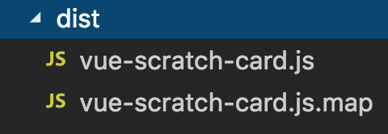

title: 基于刮刮卡vue组件发布一个npm包
date: 2018-10-21 13:50:49
tags:
---


[一、前言](#一、前言)
[二、刮刮卡vue组件的实现](#二、刮刮卡vue组件的实现)
[三、发布到npm](#三、发布到npm)
[四、安装使用包](#四、安装使用包)
[五、总结](#五、总结)

## 一、前言

项目中需要实现一个刮刮卡的模块，项目结束后沉淀项目时刚好可以把刮刮卡模块封装好，在下次新的项目中要用到时，可以更好的提高项目的效率，当然也更好地提供给其他小伙伴使用。

源码地址：[https://github.com/ZENGzoe/vue-scratch-card](https://github.com/ZENGzoe/vue-scratch-card)
npm包地址：[https://www.npmjs.com/package/vue-scratch-card0](https://www.npmjs.com/package/vue-scratch-card0)

刮刮卡组件的效果如下：


## 二、刮刮卡vue组件的实现

刮刮卡功能的实现可以分三步：

#### 1.工作流的搭建

工作流使用的是`vue-cli`的`webpack-simple`模版，能够满足组件基本的编译要求：

```
vue init webpack-simple vue-scratch-card

```

执行后，根据组件录入package.json的信息。

```
Use sass? (y/N) y
```

在项目这里我选择的是`use sass`。

在`src`目录下创建`packages`目录，用于存放所有的子组件，在本组件中只有一个刮刮卡组件，因此在`packages`里新建`scratch-card`目录用于存放我们的刮刮卡组件。如果还有其他子组件，可以继续在`packages`添加子组件，最终目录如下：

```
.
├── README.md
├── index.html
├── node_modules
├── package-lock.json
├── package.json
├── src
│   ├── App.vue
│   ├── assets
│   │   └── logo.png
│   ├── main.js             //组合所有子组件，封装组件
│   ├── main.js             //入口文件
│   └── packages            //用于存放所有的子组件
│       └── scratch-card    //用于存放刮刮卡组件
│           └── scratch-card.vue   //刮刮卡组件代码
└── webpack.config.js
```

为了支持组件可以使用标签`<script>`的方式引入，封装成组件的打包文件只需要统一打包为js：



因此需要修改我们的配置文件`webpack.config.js`：

```
//webpack.config.js
 output: {
    path: path.resolve(__dirname, './dist'),
    publicPath: '/dist/',
    filename: 'vue-scratch-card.js',
    library : 'vue-scratch-card',  //设置的是使用require时的模块名
    libraryTarget : 'umd',    //libraryTarget可以设置不同的umd代码，可以是commonjs标准、amd标准，也可以生成通过script标签引入的
    umdNamedDefine : true,    //会对UMD的构建过程中的amd模块进行命名，否则就用匿名的define
},
```

同时，为了保留打包的`dist`目录，需要在`.gitignore`中去掉`dist`目录。

<br/>

#### 2.canvas实现刮刮卡

刮刮卡主要是通过`Canvas`实现，一般刮刮卡是和抽奖结合，那么我们的`DOM`应该要包含可以显示抽奖结果的`DOM`，结构如下：

```
//scratch-card.vue
<template>
    <div :id='elementId' class='scratchCard'>
        <div class="result" v-show='showLucky'>
            <slot name='result'></slot>
            
        </div>
        <canvas id='scratchCanvas'></canvas>
    </div>
</template>
```

其中，添加了一个`<slot>`插槽，为了可以在调用这个组件时，定制抽奖结果的`DOM`。

接下来是实现刮刮卡的逻辑部分。

大致js结构如下：

```
//scratch-card.vue
    export default {
        name : 'vueScratchCard',
        data(){
            return {
                supportTouch : false,       //是否支持touch事件
                events : [],                //touch事件 or mouse事件合集
                startMoveHandler : null,     //touchstart or mousedown 事件
                moveHandler : null,         //touchmove or mousemove 事件
                endMoveHandler : null,      //touchend or mouseend 事件
                showLucky : false,          //显示隐藏抽奖结果
                firstTouch : true,          //是否第一次touchstart or mousedown
            }
        },
        props : {
            elementId : {   //组件最外层DOM的id属性
                type : String,
                default : 'scratch',
            },
            moveRadius : {  //刮刮范围
                type : Number,
                default : 15
            },
            ratio : {   //要求刮掉的面积占比，达到这个占比后，将会自动把其余区域清除
                type : Number,
                default : 0.3
            },
            startCallback : {   //第一次刮回调函数
                type : Function,
                default : function(){
                }
            },
            clearCallback : {   //达到ratio占比后的回调函数
                type : Function ,
                default : function(){
                }
            },
            coverColor : {  //刮刮卡遮罩颜色
                type : String,
                default : '#C5C5C5'
            },
            coverImg : {    //刮刮卡遮罩图片
                type : String,
            },
            resultImg : {       //中奖的图
                type : String,
                default : 'https://raw.githubusercontent.com/ZENGzoe/imagesCollection/master/2018/default.jpg'
            }
        },
        mounted : function(){
        },
        methods : {
        }
    }
```

开始编写逻辑之前，需要考虑组件可配置属性，添加到`props`中，让组件的使用能够更加灵活。

在组件挂载到实例中时，开始初始化组件，绘制`Canvas`。

```
//scratch-card.vue
...

mounted : function(){
    this.$nextTick(() => {
        this.init();
    })
},
methods : function(){
    init : function(){
        if(!this.isSupportCanvas){
            alert('当前浏览器不支持canvas');
            return;
        }

        const canvasWrap = document.getElementById(this.elementId);
        this.canvas =canvasWrap.querySelector('#scratchCanvas');
        this.ctx = this.canvas.getContext('2d');
        this.canvas.width = canvasWrap.clientWidth;
        this.canvas.height = canvasWrap.clientHeight;

        this.createCanvasStyle();
    },
    createCanvasStyle : function(){
        var _this = this;
        //当传入coverImg时，优先使用图片，否则使用颜色作为刮刮卡遮罩
        if(this.coverImg){
            var coverImg = new Image();
            coverImg.src = this.coverImg;
            coverImg.onload = function(){
                _this.ctx.drawImage(coverImg , 0 , 0 , _this.canvas.width , _this.canvas.height);
            }
        }else{
            _this.ctx.fillStyle = _this.coverColor;
            _this.ctx.fillRect(0,0,_this.canvas.width , _this.canvas.height);
        }
    },
}
...
```

当需要向`Canvas`添加跨域图片时，需要将图片转为base64。

｀PC`页面绑定的事件为`mousesdown`、`mousemove`、`mouseup`，移动端页面中绑定的事件为`touchstart`、`touchmove`、`touchend`，因此需要区分在不同端的事件绑定。

```
//scratch-card.vue
...
init : function(){
    ...
    this.bindEvent();
},
bindEvent : function(){
    if('ontouchstart' in window) this.supportTouch = true;
    this.events = this.supportTouch ? ['touchstart', 'touchmove', 'touchend'] : ['mousedown', 'mousemove', 'mouseup'];
    this.addEvent();
},
...
```

为了减少篇幅，绑定事件`addEvent`的具体实现，可以查看源码。

刮刮卡擦拭的效果由`Canvas`的`globalCompositeOperation`属性实现，设置`globalCompositeOperation = "destination-out"`让手指或鼠标与`Canvas`画布重合区域不可见，就可以让刮刮卡的擦拭效果。在`touchmove`和`mousemove`绑定的事件中添加擦拭效果。实现如下：

```
moveEventHandler : function(e){
    e.preventDefault();
    
    e = this.supportTouch ? e.touches[0] : e;

    const canvasPos = this.canvas.getBoundingClientRect(),
          scrollT = document.documentElement.scrollTop || document.body.scrollTop,
          scrollL = document.documentElement.scrollLeft || document.body.scrollLeft,
           //获取鼠标或手指在canvas画布的位置
          mouseX = e.pageX - canvasPos.left - scrollL, 
          mouseY = e.pageY - canvasPos.top - scrollT;

    this.ctx.beginPath();
    this.ctx.fillStyle = '#FFFFFF';
    this.ctx.globalCompositeOperation = "destination-out";
    this.ctx.arc(mouseX, mouseY, this.moveRadius, 0, 2 * Math.PI);
    this.ctx.fill();
},
```

每次手指或鼠标离开时，计算擦拭区域，当擦去的区域大于画布的约定的百分比时，清除整个`Canvas`画布。擦拭区域的计算相当于计算画布上的像素点是否还有数据，通过`getImageData`方法可获取画布的像素点。具体实现如下：

```
caleArea : function(){
    let pixels = this.ctx.getImageData(0,0,this.canvas.width,this.canvas.height),
        transPixels = [];
    
    pixels.data.map((item , i) => {
        const pixel = pixels.data[i+3];
        if(pixel === 0){
            transPixels.push(pixel);
        }
    })

    if(transPixels.length / pixels.data.length > this.ratio){
        this.ctx.clearRect(0,0,this.canvas.width , this.canvas.height);
        this.canvas.removeEventListener(this.events[0],this.startMoveHandler);
        this.canvas.removeEventListener(this.events[1] , this.moveHandler , false);
        document.removeEventListener(this.events[2] , this.endMoveHandler , false);

        this.clearCallback();
    }
}
```
每次手指或鼠标离开时，为了不污染其他区域的事件和占用内容，要清除绑定的事件。

那么到这里就实现了刮刮卡的所有逻辑，接下来就是要将刮刮卡组件封装成插件。

<br/>

#### 3.封装成插件

将VUE组件封装成插件，就应该有一个公开的`install`方法，这样才可以通过`Vue.use()`调用插件。详细介绍可以看VUE的[官方文档](https://cn.vuejs.org/v2/guide/plugins.html)。

在`scratch-card`目录中新建`index.js`，用来封装`scratchCard`的`install`方法：

```
//scratch-card/index.js
import vueScratchCard from './scratch-card'

vueScratchCard.install = Vue => Vue.component(vueScratchCard.name , vueScratchCard);

if(typeof window !== 'undefined' && window.Vue){
    window.Vue.use(vueScratchCard);
}

export default vueScratchCard;
```

到这里我们封装好了我们的子组件刮刮卡，如果有其他子组件，可以继续往`packages`目录中添加，最后在`src`目录下新建`index.js`，组合所有的子组件。

```
//src/index.js

import VueScratchCard from './packages/scratch-card/index.js';

const install = function(Vue , opts = {}){
    Vue.component(VueScratchCard.name , VueScratchCard);
}

//支持使用标签<script>的方式引入
if(typeof window !== 'undefined' && window.Vue){
    install(window.Vue);
}

export default {
    install ,
    VueScratchCard
}
```

这样就完成了我们的组件啦～～

## 三、发布到npm

发布到`npm`前，需要修改`package.json`，设置`"private":true`，否则`npm`会拒绝发布私有包。除此之外，还需要添加入口文件，`"main":"dist/vue-scratch-card.js"`，可以在当`require`或`import`包时加载模块。

```
//package.json
  "private": false,
  "main" : "dist/vue-scratch-card.js",
```

npm发布流程如下：

1.在[npm](https://www.npmjs.com)注册账号

2.登陆npm，需要将镜像地址改为npm

```
npm login
```

3.添加用户信息，输入账号密码

```
npm adduser
```

4.发布

```
npm publish 
```

发布成功后，就可以在[npm](https://www.npmjs.com)搜索到发布的包。

<br/>

## 四、安装使用包

之后我们就可以在直接安装使用了～～

安装：

```
npm install vue-scratch-card0 -S 
```

使用：

1.通过import使用

```
import ScratchCard from 'vue-scratch-card0'
Vue.use(ScratchCard)

<vue-scratch-card 
    element-id='scratchWrap'
    :ratio=0.5
    :move-radius=50
/>

```

2.通过标签`<script>`引用

```
<vue-scratch-card 
    element-id='scratchWrap'
    :ratio=0.5
    :move-radius=50
    :start-callback=startCallback
    :clear-callback=clearCallback
    cover-color='#caa'
  />

<script src="./node_modules/vue/dist/vue.js"></script>
<script>
    new Vue({
      el : '#app',
      data () {
        return {

        }
      },
      methods : {
        startCallback(){
          console.log('抽奖成功！')
        },
        clearCallback(){
          console.log('清除完毕！')
        }
      }
    })
</script>
```

<br/>

##  五、总结

发布npm包时，一直提示`Package name too similar to existing packages`，但是在npm官网中，又没有查到命名相同的包，这个时候就不停的换`package.json`中的name，最后终于发布成功了，太不容易了～_～


