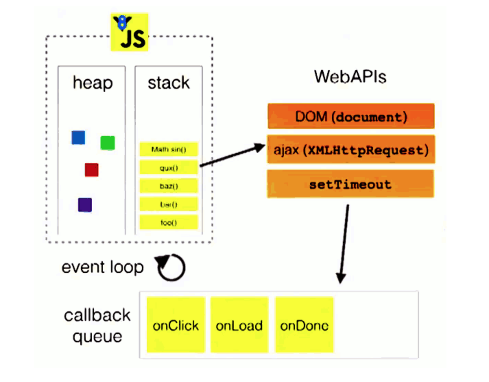
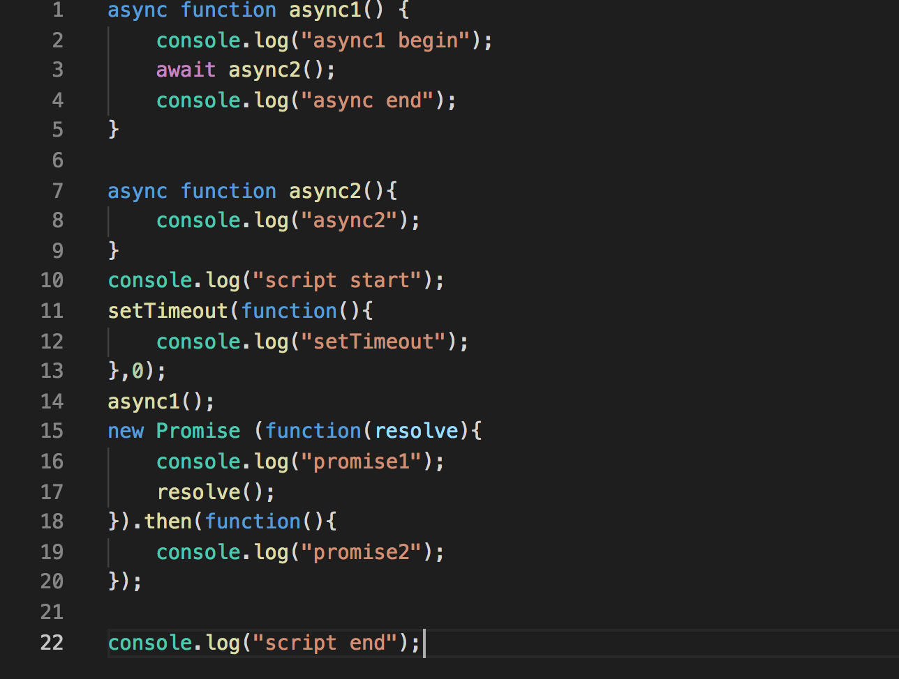

title: 面对JS的Event Loop终于不懵逼
date: 2018-11-17 17:41:32
tags:
---

[一、前言](#一、前言)
[二、JS的事件运行机制](#二、JS的事件运行机制)
[三、Macrotask和Microtask](#三、Macrotask和Microtask)
[四、回到题目](#四、回到题目)
[参考文档](#参考文档)

## 前言
最近看到一道这样的题：

```javascript   

async function async1() {
    console.log("async1 begin");
    await async2();
    console.log("async end");
}

async function async2(){
    console.log("async2");
}
console.log("script start");
setTimeout(function(){
    console.log("setTimeout");
},0);
async1();
new Promise (function(resolve){
    console.log("promise1");
    resolve();
}).then(function(){
    console.log("promise2");
});

console.log("script end");

```

这道题里面涵盖了JS的事件运行机制的知识，在给出这道题答案之前，我们先了解下JS的事件运行机制是什么。

## JS的事件运行机制

JS是单线程编程语言，也就是Js里面的任务是一个个排好队执行的，前面的任务执行完再执行下一个任务。

接下来先看一段代码：

```
console.log(1);
setTimeout(function(){
    console.log(2)
},1000)
console.log(3)
```

执行这段代码，发现结果是1,3,2。等等，Js是单线程的话，执行结果不应该是1,2,3吗？

原来，JS的主线程拥有一个执行栈和一个任务队列，执行栈用于执行当前任务，任务队列用于存放异步任务的回调函数。主线程在执行代码时，将同步的任务塞入执行栈中执行，执行完毕任务之后将该任务弹出执行栈。在遇到异步任务时，异步任务执行完之后会将结果放入到任务队列中。当执行栈中的任务执行完毕之后，就会读取任务队列，塞入执行栈中执行。执行栈执行完毕之后不断重复从任务队列中读取任务，这个过程又称为Event Loop（事件循环）。

上图来自Philip Roberts的[What the heck is the event loop anyway?](https://2014.jsconf.eu/speakers/philip-roberts-what-the-heck-is-the-event-loop-anyway.html)



上图中详细的展示了JS的事件运行机制过程，左上角为执行栈，右上角为异步任务，异步任务执行完毕后将回调函数塞入底部的任务队列中。执行栈不断地从任务队列中读取任务。

## Macrotask和Microtask

Event Loop中的异步任务有两种，Macrotask和Microtask。

属于Macrotask任务的有：`setTimeout`、`setInterval`、`setImmediate`、`I/O`、`UI`渲染、`script`标签代码等

属于Microtask任务的有：`Promise`、`async/await`、`process.nextTick`、`Object.observe`、`MutationObserver`等

`process.nextTick`和`setImmediate`是Node.js提供的api，其中`process.next`是在当前执行栈的最后，任务队列之前进行的回调函数，也就是在每次读取任务队列之前优先执行。

JS的事件运行机制详细到Macrotask和Microtask的过程是这样的：

1. 执行栈为空，Microtask队列为空，Macrotask队列里有`script`标签代码。

2. Macrotask队列中的`script`代码推入执行栈，执行同步任务。在这个过程中，如遇到新的Macrotask任务，塞入Macrotask队列中，如遇到新的Microtask任务，塞入到Microtask队列中。同步任务执行完毕之后，弹出执行栈。

3. 上一步是读取Macrotask的任务，下一步是读取Microtask的任务。读取Macrotask队列和Microtask队列的区别在于，读取Macrotask的只读取排在前面一个任务，读取Microtask的是读取全部的任务，知道全部任务执行完毕。

4. 读取完Microtask任务后，下一次又是读取Macrotask任务，如此循环，直到两个队列都清空了。

## 回到题目

了解完JS的事件运行机制，我们可以回到最初的题目上，看看代码是如何执行的：

为方便讲解，将截出有序号的代码：



**1. 执行栈为空，Microtask队列为空，Macrotask队列里有script全局代码。**

**2. 执行栈读取Macrotask队列，执行任务。**
执行到第10行，打印出`script start`。
执行到第11行，遇到`setTimeout`，`setTimeout`为Macrotask任务，塞入Macrotask队列中。
执行到第14行，进入`async1`函数，打印出`async1 begin`。
执行到第3行，进入`async2`函数，打印出`async2`，第3行有`await`修饰符，因此将后面的第四行代码塞入Microtask队列。
执行到第15、16行，打印出`promise1`，`Promise`为Microtask任务，将`Promise`回调函数塞入Microtask队列。
执行到第22行，打印出`script end`。当前Macrotask任务执行完毕，执行栈推出此任务。
此时，Macrotask队列有：第11行。Microtask队列有：第4行、第17行。

**3. 执行栈读取Microtask队列。栈是“先进后出，后进先出”。因此从后面开始执行。**
执行第17行，执行到19行，打印`promise2`。
执行第4行，打印`async end`。 
执行栈一一推出任务，Microtask队列清空。
此时Macrotask队列有：第11行。Microtask队列为空。

**4. 执行栈读取Macrotask队列。**
执行第11行，执行到12行，打印出`setTimeout`。
执行栈推出此任务，Macrotask队列清空。
此时Macrotask队列为空，Microtask队列为空，任务结束。

到这里了解清楚了Event Loop，是不是就不懵逼了呢？

## 参考文档
[What the heck is the event loop anyway?](https://2014.jsconf.eu/speakers/philip-roberts-what-the-heck-is-the-event-loop-anyway.html)
[Tasks, microtasks, queues and schedules](https://jakearchibald.com/2015/tasks-microtasks-queues-and-schedules/)
[理解 JavaScript 中的 macrotask 和 microtask](https://juejin.im/entry/58d4df3b5c497d0057eb99ff)
[前端性能优化原理与实践-Event Loop与异步更新策略](https://juejin.im/book/5b936540f265da0a9624b04b/section/5bb1815c6fb9a05d2d0233ad)


