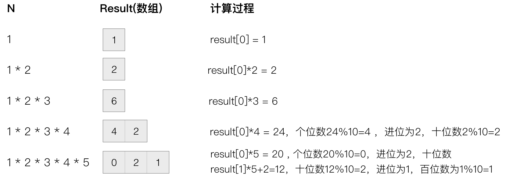

title: 面试题之Javascript实现10万的阶乘
date: 2019-09-17 22:17:29
tags:
---

## 前言

最近面试的时候遇到一道面试题，就是实现10000!，当时的第一反应是直接用递归实现：

```
function factorial_recursion(n){
    if(n <= 1) return 1;

    return n * factorial_recursion(n-1)
}
```

但是这样就会存在问题，Js中最大的安全整数为2^53- 1，10000!结果溢出该范围，代码运行结果为Infinity，无法计算出正确的结果。

那么如何才能计算大数据的阶乘呢？

## BigInt

可以使用Js最新的基本数据类型BigInt，BigInt数据类型支持范围更大的整数值，可以解决整数溢出问题。

BigInt数据通过BigInt构造函数创建，修改代码如下：

```
function factorial_recursion(n){

    if(n <= 1) return 1;

    return BigInt(n) * BigInt(factorial_recursion(n-1))
}
```

通过`factorial_recursion(10000)`就可以得出结果。

但当计算更高数值的阶乘时，比如求20000的阶乘，出现栈溢出的情况。

那么如何才能解决栈溢出问题？

## 平方差实现

**算法思路**

可以从减少乘法运算的次数角度出发，阶乘运算可转换为若干个平方差的积，使得阶乘只需要n/2次乘法，并且得出规律平方差之间的差是连续的奇数。除了平方差乘数，其他乘数根据n为奇数或偶数也有不同规律。

**算法分析**

当计算9的阶乘时：
```
1 * 2 * 3 * 4 * 5 * 6 * 7 * 8 * 9 

取中间值为基值： (5 - 4) * (5 - 3) * (5 - 2) * (5 - 1) * 5 * (5 + 1) * (5 + 2) * (5 + 3) * (5 +4)

调换位置：(5 - 1) * (5 + 1) * (5 - 2) * (5 + 2) * (5 - 3) * (5 + 3) * (5 - 4) * (5 + 4) * 5

合并为平方差：(5^2 - 1) * (5^2 - 2^2) * (5^2 - 3^2) * (5^2 - 4^2) * 5

计算平方差结果： 24 * 21 * 16 * 9  

得出规律：24、21、16、9之间的差分别为基数3、5、7，奇数基础乘数为 n / 2
```

当计算10的阶乘时：
```
1 * 2 * 3 * 4 * 5 * 6 * 7 * 8 * 9 * 10

取中间值位基值： (5 - 4) * (5 - 3) * (5 - 2) * (5 - 1) * 5 * (5 + 1) * (5 + 2) * (5 + 3) * (5 +4) * (5 + 5)

调换位置：(5 - 1) * (5 + 1) * (5 - 2) * (5 + 2) * (5 - 3) * (5 + 3) * (5 - 4) * (5 + 4) * 5 * (5 + 5)

合并为平方差：(5^2 - 1) * (5^2 - 2^2) * (5^2 - 3^2) * (5^2 - 4^2) * 5 * (5 + 5)

平方差结果： 24 * 21 * 16 * 9  

得出规律：24、21、16、9之间的差分别为基数3、5、7，偶数基础乘数为 n / 2 * n
```

**代码实现如下：**

```
function factorial_square(n){

    if(n <= 1) return 1;

    const middle = Math.ceil(n / 2);    //取中间值

    let tmp = middle * middle,
        result = n & 1 == 1 ? middle : middle * n;  //奇偶数的基础乘数规律不同

    for(let i = 1 ; i <= n - 2 ; i += 2){   //连续减奇数得出各项乘数
        tmp -= i;
        result = BigInt(result) * BigInt(tmp);
    }

    return result;
}
```

BigInt兼容性并不友好，Chrome浏览器在67+版本中才支持该数据类型。

在不支持BigInt的浏览器中怎么计算大数据阶乘呢？

## 数组存储实现

**算法思路**

可以使用数组来存储大数据结果的每位数，如result[0]存储个位数，result[1]存储十位数，以此类推。计算每位数时需要加上上一个位数得出的进位，最后再将数组反转并拼接，就可以得出大数据结果。

**算法分析**

以5! = 1 * 2 * 3 * 4 * 5为例：



**代码实现**

```
function factorial_array(n){

    let result = [1],   //存储结果
        digit = 1,      //位数，从第1位开始
        count ,         //每次计算的结果
        num ,           //阶乘的计算到的第几个
        i ,             //result中每一项
        carry;          //每次得数的进位

    for(num = 2 ; num <= n ; num++){
        for(i = 1 , carry = 0 ; i <= digit ; i++){
            count = result[i - 1] * num + carry;        //每一项计算结果
            result[i - 1] = count % 10;                 //将一个数的每一位数利用数组进行储存
            carry = (count - result[i - 1]) / 10        //记录进位
        }

        while (carry) { //如果还有进位，继续存储
            result[digit] = carry % 10;
            carry = (carry - result[digit]) / 10;
            digit++;
        }
    }
    return result.reverse().join("");
}
```

## 总结

**1.递归实现**

优点：实现代码简单，速度快

缺点：较大数据容易出现栈溢出，兼容性不够友好 

**2.平方差实现**

优点：乘数计算少，速度快

缺点：兼容性不够友好 

**3.数组存储实现**

优点：数组清晰地存放大数据的每个位数，每次计算时能简单地从低位到高位求值

缺点：需要用数组存储大数据的每位数，需要占用较大内存，速度较慢

[demo地址](https://github.com/ZENGzoe/factorialDemo)


